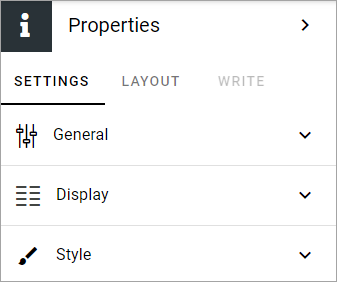
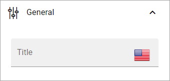
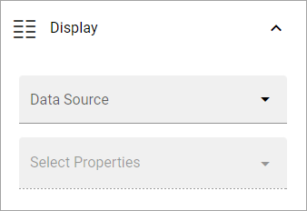
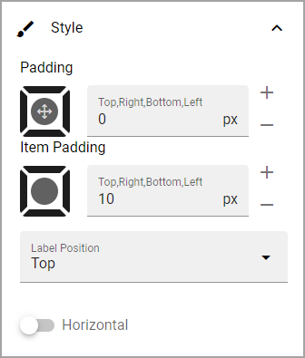

Properties
================================================

**This documentation is just started.**

Use this block to display information from a property, for example useful when creating a custom user profile card. This block is available in Omnia 7.0 and later.

Settings
***********
The following settings are available for this block:

General
------------
Here you can add a title for the block, if needded, in any of the tenant languages. Click the flag to change language.

Display
---------
Under Display you decide which properties to display.

+ **Data source**: Available as sources for properties are; App, Page, User, User (Microsoft Graph) or User (Sharepoint).
+ **Select Properties**: When you have selected data source, choose one or more properties to display. Note that different sets of properties are available depending on source chosen and some properties may require additional settings.

Style
-----
Available style options for the block are these:

LAYOUT and WRITE
******************
The WRITE tab is not available for this block. The LAYOUT tab contains general block settings, see: :doc:`General Block Settings </blocks/general-block-settings/index>`

