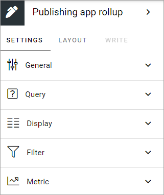
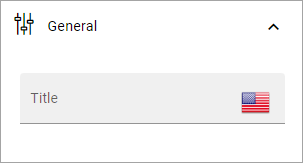
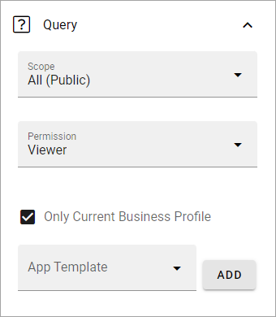
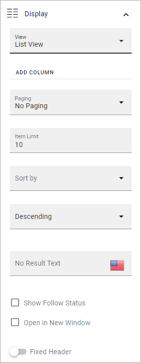
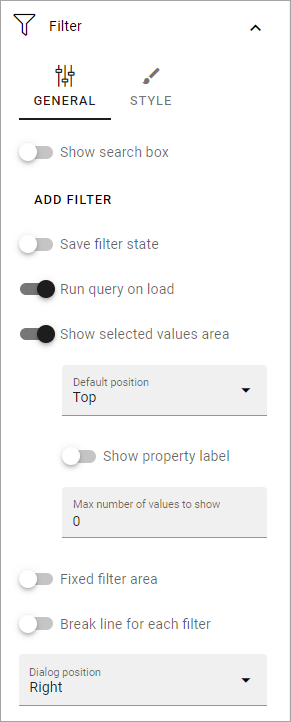
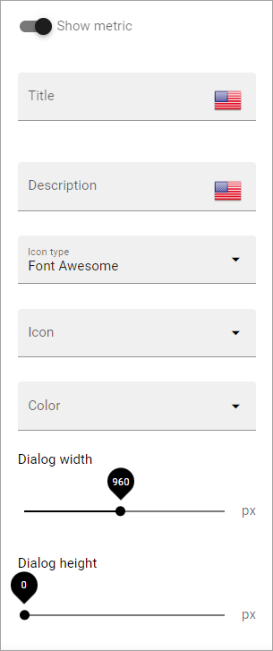

Publishing app rollup block
==============================

The purpose of this block is to list all, or some of the publishing apps available in the business profile.

Settings
***********
The following settings are available for the block:

General
---------
Here you can add a title for the block, in any available tenant language.

Query
-----------
Here you decide what to rollup in the block. 

+ **Scope**: You can choose to rollup all public publishing apps, all the logged in user follows, or to display the last publishing app the user visited.
+ **Permission**: Used for security trimming. For more information, see: :doc:`Security trimming in app rollups </general-assets/security-trimming-apps/index>`
+ **Only current business profile**: If only publishing apps from the current business profile should be listed, select this option (default).
+ **Site template**: Select publishing app template from the list. You must select template, even if just one is available.

Custom date filtering
^^^^^^^^^^^^^^^^^^^^^^
In Omnia 7.7 and later you may be able to use custom filering.

If the scope is filtered on some kind of time property, custom date filtering can be set.

Here's an example:

.. image:: publishing-app-rollup-custom-date.png

See this page for more information about custom date filtering: :doc:`Custom date filtering </general-assets/custom-date-filtering/index>` 

Display
--------
Here you can select List View or Card View.

Available settings depends on what you select. All options are listed below (not all options are shown in the image).

+ **Add column**: If you select List View, you must add at least one column for the display to work.
+ **Cards per row**: Available for Card view. As it says, set the number of cards to show per row.
+ **Descending/Ascending**: Select type of sorting here.
+ **Fixed header**: The header of the rollup can be shown all the time (Fixed). If you want that, select this option.
+ **Paging**: Select how paging should work; "No paging", "Classic" or "Scroll".
+ **Image**: Available for Card view. Choose to display an image or not.
+ **Item limit**: Set the number of sites to be shown on each "page" of the list.
+ **No results text**. If you would like to add a text to be shown when rollup returns no result, add it here. You can add a message in any available tenant language.
+ **Sort by**: Select what to sort the list on, and then select Ascending or Descending sorting.
+ **Padding**: You can add some padding between the block's borders and the list.
+ **Open in new window**: For some (maybe all) of of the teamworks, it can be a good idea to open the link in a new window.
+ **Show follow status**: Follow status is indicated by a star, filled if the teamwork is followed, hollow if not, see below for an example.
+ **Term properties**: For Card view, you can add term properties to be shown on the cards. Click "Add" and select one or more properties.

If you select STYLES for Card View, the following, additional settings becomes available:

.. image:: publishing-app-rollup-settings-styles.png

Filter
------------------
Here you can add filters so users can filter (= choose what to see in the rollup). 

Filter options are the same in most blocks, and are described on this page: :doc:`Filter options for blocks </blocks/general-block-settings/filter-options-block/index>`

Metric
*******
Using these settings you can show a metric in the block displaying the number of apps that is valid for the query settings. The metric can then be clicked to display the rollup you have set up.

This can for example be used to create a rather compact page or section with different metrics in different blocks. The user can then click the desired metric to see the full list.

+ **Show metric**: Select this to decide to show the metric (and the settings below becomes available).
+ **Title**: Add a title for the metric if needed.
+ **Description**: A description for the metric can also be added.
+ **Icon type/Icon**: Select an icon type and an icon, if you want to.
+ **Color**: This sets the color for the divider above the metric. 
+ **Dialog width/height**: Set width and height for the dialog displaying the list of pages.

Layout and Write
*********************
The WRITE TAB is not used here. The LAYOUT tab contains general settings, see: :doc:`General block settings </blocks/general-block-settings/index>`

