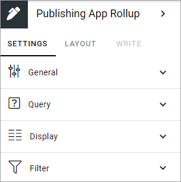

Publishing App Rollup block
==============================

The purpose of this block is to list all, or some of the Publishing Apps available in the Business Profile.

Settings
***********
The following settings are available for the block:

General
---------
Here you can add a title for the block, in any available tenant language (click the flag to change language).

.. image:: publishing-app-rollup-settings-general-v7.png

Query
-----------
Here you decide what to rollup in the block. (Image from Omnia v7).

.. image:: publishing-app-rollup-settings-query-v7.png

+ **Scope**: You can choose to rollup all public publishing apps, all the logged in user follows, or to display the last publishing app the user visited.
+ **Permission**: Available in Omnia 7.0 and later. Used for security trimming. For more information, see: :doc:`Security trimming in app rollups </general-assets/security-trimming-apps/index>`
+ **Only Current Business Profile**: If only publishing apps from the current Business Profile should be listed, select this option (default).
+ **Site Template**: Select Publishing App Template from the list. You must select template, even if just one is available.
+ **Run Query On Load**: Decide if the query should be run on load, so the list is filled with publishing apps, or not. If a list is very long it can be a good idea to add a search box, and to deselect this option. You add a search box under Filter, see below. (This option is moved to the Filter section in Omnia 7.0 and later).

Display
--------
Here you can select List View or Card View.

.. image:: publishing-app-rollup-settings-display-v7.png

Available settings depends on what you select. All options are listed below (not all options are shown in the image).

+ **Add Column**: If you select List View, you must add at least one Column for the display to work.
+ **Cards per Row**: Available for Card view. As it says, set the number of cards to show per row.
+ **Descending/Ascending**: Select type of sorting here.
+ **Fixed header**: The header of the rollup can be shown all the time (Fixed). If youo want that, select this option.
+ **Paging**: Select how paging should work; "No Paging", "Classic" or "Scroll".
+ **Image**: Available for Card view. Choose to display an image or not.
+ **Item Limit**: Set the number of sites to be shown on each "page" of the list.
+ **No results text**. If you would like to add a text to be shown when rollup returns no result, add it here. You can add a message in any available tenant language (click the flag to change language).
+ **Sort By**: Select what to sort the list on, and then select Ascending or Descending sorting.
+ **Padding**: You can add some padding between the block's borders and the list.
+ **Open in new window**: For some (maybe all) of of the teamworks, it can be a good idea to open the link in a new window.
+ **Show Follow status**: Follow status is indicated by a star, filled if the teamwork is followed, hollow if not, see below for an example.
+ **Term Properties**: For Card view, you can add term properties to be shown on the cards. Click "Add" and select one or more properties.

If you select STYLES for Card View, the following, additional settings becomes available:

.. image:: publishing-app-rollup-settings-styles.png

Filter
------------------
Here you can add filters so users can filter (= choose what to see in the rollup). Image from Omnia v7.

.. image:: publishing-app-rollup-settings-filter-v7.png

Filter options in Omnia v7 are described on this page: :doc:`Filter options for blocks in Omnia 7.0 </blocks/general-block-settings/filter-options-block/index>`

Layout and Write
*********************
The WRITE TAB is not used here. The LAYOUT tab contains general settings, see: :doc:`General Block Settings </blocks/general-block-settings/index>`

