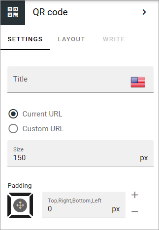
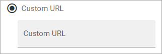

QR code
=======================================

Use this block to place a QR code on any Omnia page.

+ **Title**: Add a title for the block if needed, in any tenant language. 
+ **Current URL**: To create a QR code for the current page, select this option.
+ **Custom URL**: To create a QR code for any URL, select this option.
+ **Size**: Set the size of the QR code in pixels here. Default=150.
+ **Padding**: Add some padding if needed.
  
When you select "Custom URL", just type the URL in the field:
  

