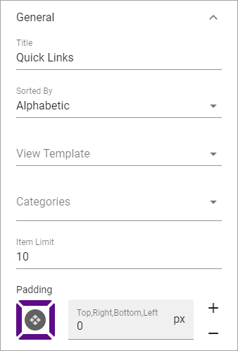

Quick Links
==============

Administrators can add and edit shared links using functionality in Omnia Admin. Links can be shown either for the whole tenant or for a specific Business Profile. Shared links will be shown in My Links.

You can use this block to show shared links on any page.

Settings
*********
The following settings are available for the block:

.. image:: quick-links-settings-new.png

General
--------
The following is available here:

+ **Title**: Yo can edit the title shown for block.
+ **Sorted By**: Decide how to sort the link list; Alphabetic or Last Visited order.
+ **View Template**: Select view for the list here; Simple List, App Icons, Navigation View or App Launch.
+ **Categories**: Shared links can be categorized. Select to show one or more categories here. If no selection is made, all categories are shown.
+ **Item Limit**: Set the number of links to be shown per "page" in th list.
+ **Padding**: You can set padding between the block border and the list using this settings.

Custom Colors
--------------
You should primarily set colors centrally but you can change colors for some elements here, if needed:

.. image:: quick-links-settings-colors.png

Layout and Advanced
**********************
The tabs Layout and Advanced contain general settings, see: :doc:`General Block Settings </blocks/general-block-settings/index>`

