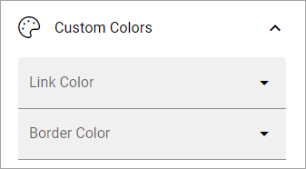

Quick links
==============

Administrators can add and edit shared links using functionality in Omnia admin. Links can be shown either for the whole tenant or for a specific business profile. Shared links will be shown in My links.

You can use this block to show shared links on any page.

Settings
*********
The following settings are available for the block:

.. image:: quick-links-settings-v7.png

General
--------
The following is available here:

.. image:: quick-links-settings-general-v7.png

(All options are not shown in the image.)

+ **Title**: If a title should be shown for the block, add it in this field. If no variation exists for the page, it looks like in the image above and you can set the title in the languages active in the tenant. If variations exists, only one title can be set. In that case, titles in other languages are set in the variations.
+ **Sorted by**: Decide how to sort the link list; Alphabetic or Last visited order.
+ **View template**: Select view for the list here; Simple list, App icons, Navigation view or App launch.
+ **Include mandatory links**: Choose to include mandatory links, or not. (In earlier versions, mandatory links are always shown).
+ **Include non-mandatory links**: If non-mandatory Links should be displayed, select this option. 
+ **Use targeting**: Select to use targeting (meaning the targeting that was set up for the links in Omnia admin) or not for the links you choose to display here. Effects mandatory links as well. Normally this option should be selected as there are good reasons for the targeting of certain links, but in specialized implementations it is still possible to choose to display all links, targeted or not.
+ **Include personal links**: If the logged in user's personal links (= created by the user) should be displayed, select this option.
+ **Include following links**: Following links are non mandatory links that the user has chosen in his or her My links list. If such links should be shown in this block, select this option. 
+ **No result text**: Here you can add a text to be shown when the query is empty, if you wish.
+ **Categories**: Shared links can be categorized. Select to show one or more categories here. If no selection is made, all categories are shown.
+ **Item limit**: Set the number of links to be shown per "page" in th list.
+ **Padding**: You can set padding between the block border and the list using these settings.

Custom colors
--------------
You should primarily set colors centrally but you can change colors for some elements here, if needed:

Layout and Write
*********************
The WRITE Tab is not used here. The LAYOUT tab contains general settings, see: :doc:`General block settings </blocks/general-block-settings/index>`

