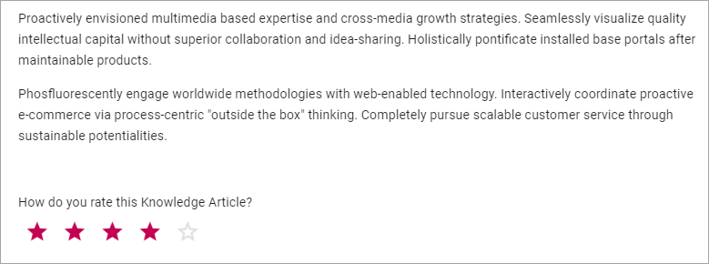
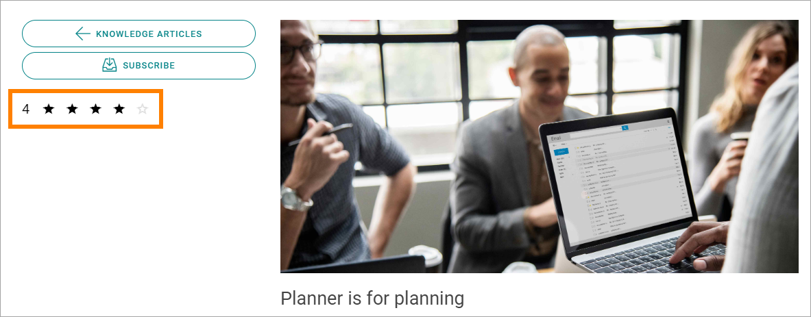

Rating
==================

The Rating block may have the most use on community pages, such as Knowledge articles, but can be used on any type of content page or in any page type.

The block has two main uses, which can be in the same block or separately:

1. To make it possible for users to rate the page. Here's an example:

A user can click the stars to rate the page. It can be done in half steps or whole steps. A user can only rate a page once, but can change his or her rating anytime.

2. To display average rating. Here's an example of that:

For Knowledge articles, the list "Top rated" uses the average rating to sort the list.

.. image:: rating-top-rated.png

Settings for the block
***********************
The following settings are available:

.. image:: rating-settings-new.png

+ **Title**: If a title should be displayed for the block, add it here. (This is not the text shown in the block).
+ **Show average rating**: If you use the block to show average rating, and show it as stars, select this option. 
+ **Show average rating in numbers**: To show the average rating in numbers, as well as with stars, select this option.
+ **Size**: You can set the size of the content of the block, using this slider. The size of teh block title is not changed. 
+ **Show submit rating**: If it should be possible for users to submit rating in the block, select this option.
+ **Enter rate content description**: If you selected the option above, enter a text in this field for a message to users, for example "Please rate this page".

Layout and Write
*********************
The WRITE Tab is not used here. The LAYOUT tab contains general settings, see: :doc:`General block settings </blocks/general-block-settings/index>`

