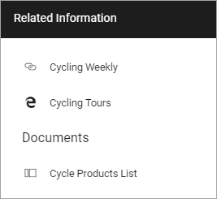
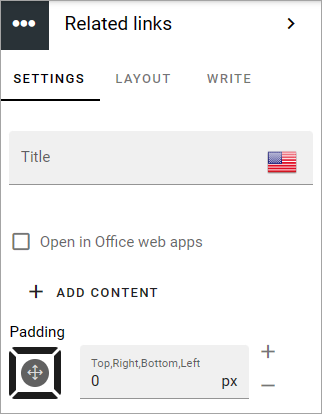
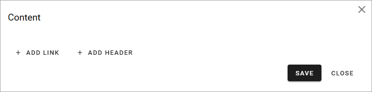
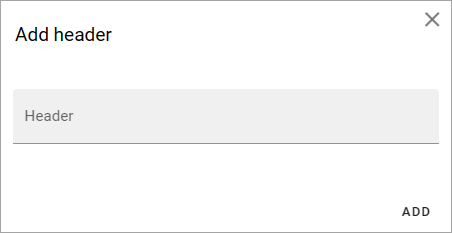
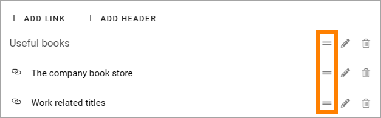
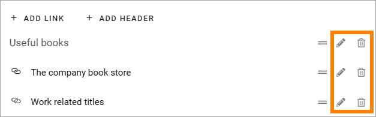

Related links
===========================================

Use this block to add links to related pages or documents in the tenant, or use a custom link to link to any web page. You can also add headings. 

It is possible to add default content to this block and you can set if it should be possible to edit the default content or not. 

If no default content is added, or if editing the default content is allowed, links and headings can be added or edited using Write mode. If default content is added and then locked, nothing can be added to the block.

Here's an example of how users will see related links:

Block Settings
****************
The following settings are available for the block:

Settings
------------
The following settings are availble on the SETTINGS tab:

+ **Title**: If a title should be shown for the block, add it in this field.  
+ **Open in Office web apps**: When it's a document link; if you want the links to open in Office web apps (meaning Microsoft 365), instead of locally installed applications, select this option.
+ **ADD CONTENT**: Click here to add deafault content to the block. Also see below.
+ **Padding**: Add some padding between the block edges and the links list, if needed.

Add default content
---------------------
When you click ADD CONTENT the the following is shown:

You work with links and headings the same way as described below.

You can use the WRITE tab to set if editors should be able to edit the default content or not, see below.

LAYOUT and WRITE
------------------
The LAYOUT tab contains general settings, see: :doc:`General block settings </blocks/general-block-settings/index>`

Using the WRITE tab you can set the following:

.. image:: links-block-write-tab-v75.png

+ **Enable overwrite in write mode**: If it should be possible for editors to edit the default content in the block, this option should be on. If not, click to set it to off.
+ **Property to store data**: Select property from the list. When one block on the page has data connected to a property, that data can be reused in all blocks that uses the same property. Page scoped. Not mandatory.

Adding links and headers
*************************
Depending on settings (see above) it can be allowed to edit links and headers, or not. If it is allowed, any editor can add and edit links and headers in the block, using Write mode.

Adding a link
---------------
When you click "Add link" the Add link general asset is opened. See this page for more information on how to add links: :doc:`Add link </general-assets/add-link/index>`

Adding a header
-----------------
If you need to add a header to the link list, click "ADD HEADER", type the header and click "ADD".

Arranging the list
*******************
When you are done adding links and headings, the list may need some arranging. Use to left-moste icon and drag and drop.

Edit or delete a link or heading
*********************************
To edit a link or heading, or delete it, use the icons.

