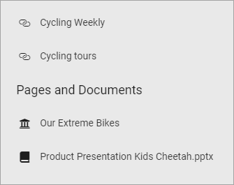
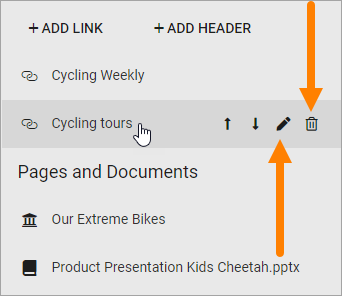

Related Links
===========================================

Use this block to add links to related pages or documents in the tenant, or use a Custom link to link to any web page. You can also add headings.

Here's an example of how users will see related links:

Adding a link
**************
When you click "Add link" the Add link general asset is opened. See this page for more information on how to add links: :doc:`Add link </general-assets/add-link/index>`

Adding a header
*****************
If you need to add a header to the link list, click "ADD HEADER", type the header and click "ADD".

.. image:: add-link-header.png

Arranging the list
*******************
When your done adding links and headings, the list may need some arranging. Do it this way:

1. Point at the link or heading you want to move.
2. Click the Up or Down arrow to move it in the list.

.. image:: add-link-move.png

Edit or delete a link or heading
*********************************
To edit a link or heading, or delete it, do the following:

1. Point at the link or heading you want to move.
2. Click the pen to edit or the dust bin to delete.

