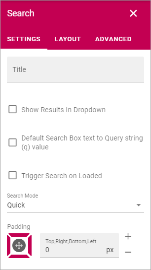

Search
===========================================

The Search block can be used for Quick Search or Advanced Search. 

**Note!** When used for Advanced Search, this block needs a really a wide area, more or less the whole page.

Settings
**********
The following settings are avilable:

+ **Title**: You can add a title for the block here. If variations exists, only one title can be set. In that case, titles in other languages are set in the variations. If no variation exists for the page, you can set the title in any or all languages active in the tenant. 
+ **Show Results in Dropdown**: If search results should be available in a dropdown list, select this option.
+ **Dropdown Max Height**: When the above option is selected you can set the maximum height in pixels for the dropdown.
+ **Default Search Box text to Query string (q) value**: (A description will be added soon.)
+ **Trigger Search on Loaded**: If a search should be trigged shen the page is loaded, select this option.
+ **Search mode**: Select search mode, Quick or Advanced.
+ **Padding**: You can add some padding if needed.

The tabs Layout and Advanced contain general settings, see: :doc:`General Block Settings </blocks/general-block-settings/index>`

Settings for Search are set up in Omnia Admin, see: :doc:`Business Profile Settings - Search </admin-settings/business-group-settings/search/index>`

Quick search example
*********************
When a user has conducted a Quick search using this block, it can look like this:

.. image:: quick-search-example-block.png

For "People" the name can be clicked to go to the person's Delve page. For pages and documents users can point at the post and click this icon for a preview:

.. image:: quick-search-example-block-preview.png

More search hits can be available through the link at the bottom:

.. image:: quick-search-example-block-more.png

When this link is clicked, the Advanced Search opens.

Advanced Search example
*************************
When a user has conducted an Advanced search using this block, it can look like this:

.. image:: advanced-search-example-block.png

Users can select categories at the top and refiners to the right.

