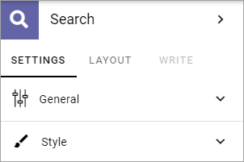
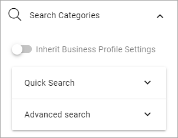
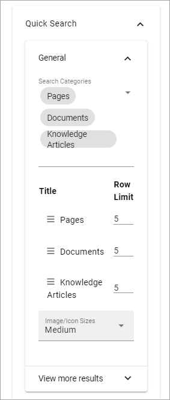
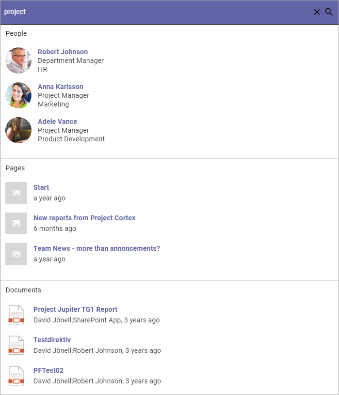
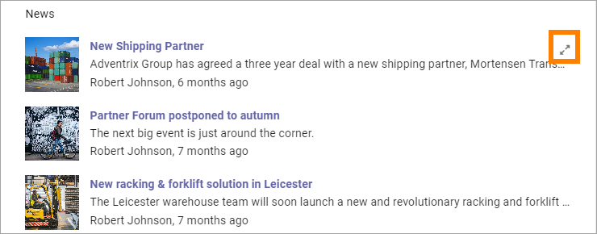
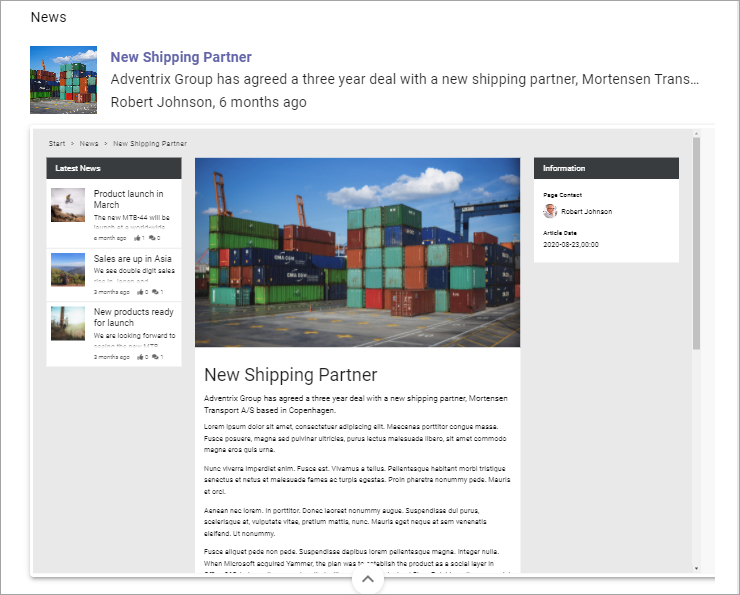
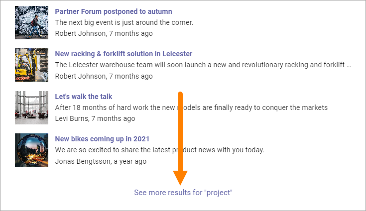

Search
============

The Search block can be used for Quick Search or Advanced Search. 

**Note!** When used for Advanced Search, this block needs a really wide area, more or less the whole page.

Settings for Search are set up in Omnia Admin, see: :doc:`Business Profile Settings - Search </admin-settings/business-group-settings/search/index>`

In Omnia 6.5 you will also be able to configure the use of search categories or inherit the ones configured on the Business Profile. See the heading "Search Categories" below.

Settings
**********
The following settings are avilable:

General
---------
The General settings are:

.. image:: search-block-settings-general.png

+ **Title**: You can add a title for the block here. If variations exists, only one title can be set. In that case, titles in other languages are set in the variations. If no variation exists for the page, you can set the title in any or all languages active in the tenant. 
+ **Auto Focus search Box**: If this option is active, the search box is automatically in focus when a user opens the page, meaning the user can start seraching directly wihtout having to click in the search bos first.
+ **Show Results in Dropdown**: If search results should be available in a dropdown list, select this option.
+ **Dropdown Max Height**: When the above option is selected you can set the maximum height in pixels for the dropdown.
+ **Add @search parameter to the query string**: For advanced search implementations. With this option active you can add parameters to the search query string, for various implementations. 
+ **Trigger Search on Loaded**: If the above option is selected, select this option if a search should be executed when the page is loaded.
+ **Search mode**: Select search mode, Quick or Advanced.
+ **Padding**: You can add some padding if needed.

Search Categories
-------------------
This option will be available in Omnia 6.5.

.. image:: search-block-settings-categories.png 

You can inherit the search settings from the Business Profile and if that is what you want to do, you don't need to change anything, it's default.

But if you would like to set specific category settings for this block, deselect and the following will be available:

**Quick Search - General**: Use it to add search categories for Quick Search. Open the list and select.

.. image:: search-block-settings-categories-quick-select.png 

When you have selected a number of categories, you can edit the order, and set a row limit for each category:

You can set image/icon size to small, medium or large.

.. image:: search-block-settings-categories-quick-select-icon-size.png 

**Quick Search - View more results**: Under "View more results" you can set where the "View more" link is placed; "At bottom", "Per category" or "Custom Target". 

.. image:: search-block-settings-categories-quick-view-more.png 

For Custom Target you can add a link to go to and can choose to open that link in a new window.

.. image:: search-block-settings-categories-quick-view-more-link.png 

**Advanced Search**: Here you can set Refiner Position to Left or Right, and you can select Search Categories to be shown.

When you have selected a number of categories, you can click the pen for more settings, for that category.

.. image:: search-block-settings-categories-advanced.png 

These settings are available for each category:

.. image:: search-block-settings-categories-advanced-settings.png 

Also note that an important difference in Omnia 6.5 will be that search categories (tabs) that do not generate any result will be hidden in Advanced Search.

Style
--------
For Style for the search box, the following settings are available:

.. image:: search-block-settings-style.png

You can try out different style settings and see the result in the block on the fly.

Layout and Write
*********************
The WRITE Tab is not used here. The LAYOUT tab contains general settings, see: :doc:`General Block Settings </blocks/general-block-settings/index>`

Quick search example
*********************
When a user has conducted a Quick search using this block, it can look like this:

and:

.. image:: quick-search-example-block-2.png

Search categories (in this example People, Pages, Documents and News) are set up in Omnia Admin, see the Heading "Quick Search" on this page: :doc:`Business Profile Settings - Search </admin-settings/business-group-settings/search/index>`

For "People" the name can be clicked to go to the person's Delve page. For pages (including news) and documents, users can point at the post and click this icon for a preview:

A page preview can look like this:

More search hits can be available through the link at the bottom:

When this link is clicked, the Advanced Search opens.

Advanced Search example
*************************
When a user has conducted an Advanced search using this block, it can look like this:

.. image:: advanced-search-example-block-new.png

Refiners, Refiner position and Search categories are set up in Omnia Admnin, see the Heading "Advanced Search" on this page: :doc:`Business Profile Settings - Search </admin-settings/business-group-settings/search/index>`

