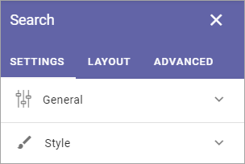

Search
============

The Search block can be used for Quick Search or Advanced Search. 

**Note!** When used for Advanced Search, this block needs a really wide area, more or less the whole page.

Settings for Search are set up in Omnia Admin, see: :doc:`Business Profile Settings - Search </admin-settings/business-group-settings/search/index>`

Settings
**********
The following settings are avilable:

The tabs Layout and Advanced contain general settings, see: :doc:`General Block Settings </blocks/general-block-settings/index>`

General
---------
The General settings are:

.. image:: search-block-settings-general.png

+ **Title**: You can add a title for the block here. If variations exists, only one title can be set. In that case, titles in other languages are set in the variations. If no variation exists for the page, you can set the title in any or all languages active in the tenant. 
+ **Auto Focus search Box**: If this option is active, the search box is automatically in focus when a user opens the page, meaning the user can start seraching directly wihtout having to click in the search bos first.
+ **Show Results in Dropdown**: If search results should be available in a dropdown list, select this option.
+ **Dropdown Max Height**: When the above option is selected you can set the maximum height in pixels for the dropdown.
+ **Add @search parameter to the query string**: For advanced search implementations. With this option active you can add parameters to the search query string, for various implementations. 
+ **Trigger Search on Loaded**: If the above option is selected, select this option if a search should be executed when the page is loaded.
+ **Search mode**: Select search mode, Quick or Advanced.
+ **Padding**: You can add some padding if needed.

Style
--------
For Style for the search box, the following settings are available:

.. image:: search-block-settings-style.png

You can try out different style settings and see the result in the block on the fly.

Quick search example
*********************
When a user has conducted a Quick search using this block, it can look like this:

.. image:: quick-search-example-block.png

Search categories (in this example People, Pages and Documents) are set up in Omnia Admnin, see the Heading "Quick Search" on this page: :doc:`Business Profile Settings - Search </admin-settings/business-group-settings/search/index>`

For "People" the name can be clicked to go to the person's Delve page. For pages and documents users can point at the post and click this icon for a preview:

.. image:: quick-search-example-block-preview.png

More search hits can be available through the link at the bottom:

.. image:: quick-search-example-block-more.png

When this link is clicked, the Advanced Search opens.

Advanced Search example
*************************
When a user has conducted an Advanced search using this block, it can look like this:

.. image:: advanced-search-example-block.png

Refiners, Refiner position and Search categories are set in Omnia Admnin, see the Heading "Advanced Search" on this page: :doc:`Business Profile Settings - Search </admin-settings/business-group-settings/search/index.hmtl#advanced-search-example>`

