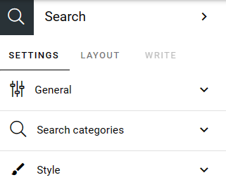
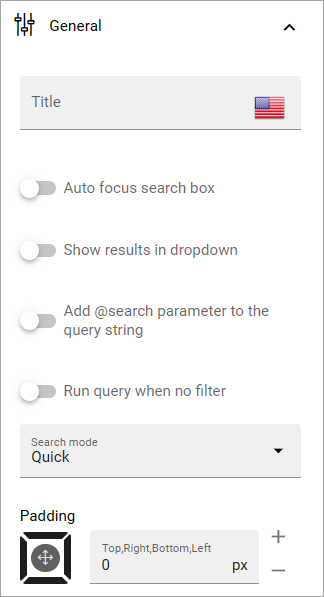
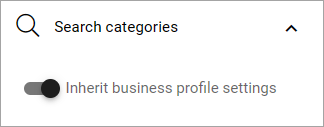
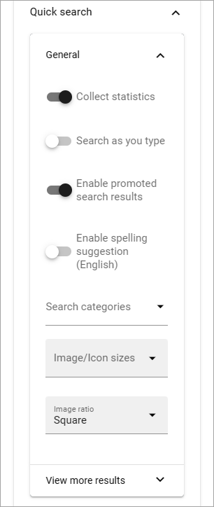
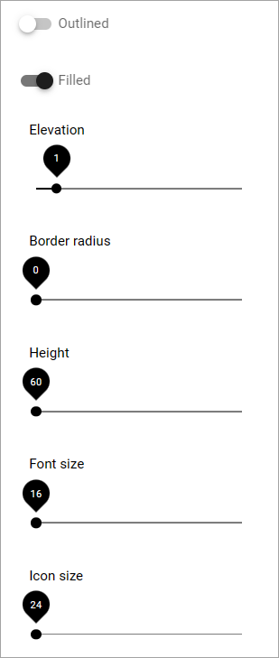

Search
============

The Search block can be used for quick search or advanced search. 

**Note!** When used for advanced search, this block needs a really wide area, more or less the whole page.

Settings for search are set up in Omnia admin, see: :doc:`Business profile Settings - Search </admin-settings/business-group-settings/search/index>`

Settings
**********
The following settings are avilable:

General
---------
The General settings are:

+ **Title**: You can add a title for the block here. If variations exists, only one title can be set. In that case, titles in other languages are set in the variations. If no variation exists for the page, you can set the title in any or all languages active in the tenant. 
+ **Auto focus search box**: If this option is active, the search box is automatically in focus when a user opens the page, meaning the user can start searching directly without having to click in the search box first.
+ **Show results in dropdown**: If search results should be available in a dropdown list, select this option.
+ **Dropdown max height**: When the above option is selected you set the maximum height in pixels for the dropdown. Default=0.
+ **Dropdown max width**: When the above option is selected you set the maximum height in pixels for the dropdown. fault=0.
+ **Add @search parameter to the query string**: For advanced search implementations. With this option active you can add parameters to the search query string, for various implementations. 
+ **Run query when no filter**: If the above option is selected, select this option if a search should be executed when the page is loaded.
+ **Search mode**: Select search mode, Quick or Advanced.
+ **Padding**: You can add some padding if needed.

Search Categories
-------------------
The following is available here:

You can inherit the search settings from the business profile and if that is what you want to do, you don't need to change anything, it's default.

But if you would like to set specific category settings for this block, deselect and the same settings as are available in Omnia admin, for Quick search and Advanced search, will be available (Quick search as an example):

For details, see the link "Business profile Settings - Search" above.

Style
--------
For Style for the search box, the following settings are available:

You can try out different style settings and see the result in the block on the fly.

Layout and Write
*********************
The WRITE Tab is not used here. The LAYOUT tab contains general settings, see: :doc:`General block settings </blocks/general-block-settings/index>`

