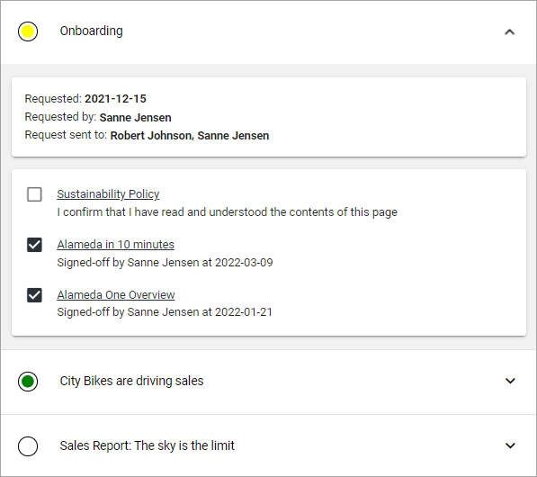
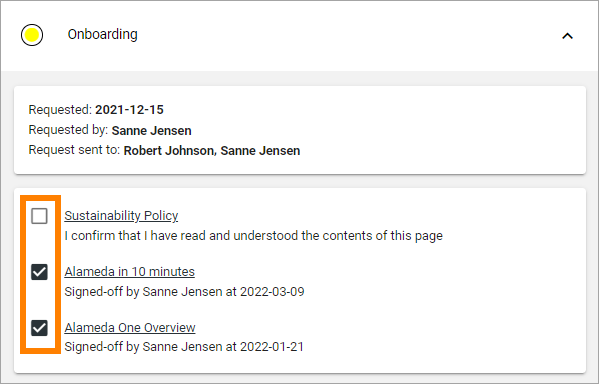
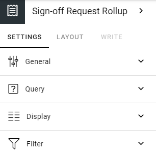
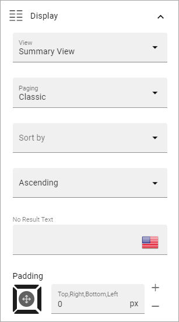

Sign-Off Requests Rollup in Omnia 6.13
=============================================

**Work on this page has just started. Will be finished soon.**

This block can be used for different purposes regarding sign-off requests. This page describes how this works in Omnia 6.13

Settings for Sign-off Requests are available in Tenant settings: :doc:`Settings for Sign-off Requests </admin-settings/tenant-settings/sign-off-requests/index>`

One way of using this block is a listing of Sign-off Requests that is sent to the logged in user or a group that the user belongs to. Here's an example of such a listing with one of the requests opened:

The colored dots indicates the progress for the whole request, meaning the progress for all recipients: green for all has signed off, yellow for some and white for none.

The user can read the information by clicking the link and can then sign off using a button. Here's two examples of how that button can look:

.. image:: sign-off-request-rollup-example-signedoff-613-1.png

Or:

.. image:: sign-off-request-rollup-example-signedoff-613-2.png

It's also possible to "undo" a request, really meaning reading the information again. "Undo" is simply done by unchecking the box:

Settings
**********
The following settings can be available:

General
----------
On the General tab you can add a title for the block, in any or all the tenant languages (click the flag to change language):

.. image:: sign-off-requests-block-settings-general-613.png

Query
----------
On this tab you decide what the block should display and for whom.

.. image:: sign-off-requests-block-settings-query-613.png

+ **Scope**: You can choose to display "All requests", "Requested by me" meaning all sign-off request tha logged in user has sent, or "Targeted to me" - meaning sign-off requests targeted to the logged in user.  
+ **Add filter**: Add a filter for the query, if you don't want all the requests within the scope to be displayed. You can select "Requested by", "Progress status", "My progress status" or "Status". "My progress status" displays the status for the logged in user. For information about what the other filters ´can display, see: :doc:`Requests </admin-settings/tenant-settings/sign-off-requests-613/sign-off-request-requests-613/index>`
+ **Page size**: To limit the number of items being displayed per “page”, add a fixed number here or use the slider.

Display
---------
This tab contains settings for the view:

+ **View**: Can be "Summary view" or "List view". Summary view can only be used for the scope "Targeted to me". The image at the top is an example of a summary view.
+ **Add column**: For List view you must add at least one column. Click this option to do that. For more information, see below.
+ **Display details in**: In a List view, a post can be clicked for further details. Here you set how the details should be displayed; in a dialog to the left or a dialog to the right. 
+ **Paging**. Avalailable for Summary view. Can be "No paging", "Classic" or "Scroll".
+ **Sort by**: Select what the view will be sorted by here.
+ **Ascending/Descending**: Sort order is selected here, you know the drill.
+ **No result text**: If a text should be shown when the query is empty, add the text here, in any or all the tenant languages.
+ **Padding**: You can add some padding if needed, the usual way for a block.

When you add a column, first select the column in the list:

.. image:: sign-off-requests-block-settings-display-column-613.png

It's then possible to set a fixed width for the column, if needed, an decide to show the label or set a custom label.

If you need to edit the settings for a column, you can click the cogwheel to display them:

.. image:: sign-off-requests-block-settings-display-column-cogwheel-613.png

Filter
--------
The following options are found on this tab:

.. image:: sign-off-requests-block-settings-filter-613.png

+ **Show search box**: To add a search box, select this option. When you do, some additional settings becomes available, see below.
+ **Hide filter by default**:  If you chose a search box you can select this option. Then no filters are shown until users has executed a search and got a search result.
+ **Save filter state**:  If you select this option the filter keeps it’s state in the page url as long as the page is active, and will be activated when the user goes back to the page, by using the browser’s Back button. The url can also be copied and for example be used to prepopulate the rollup.

The WRITE TAB is not used here. The LAYOUT tab contains general settings, see: :doc:`General Block Settings </blocks/general-block-settings/index>`

