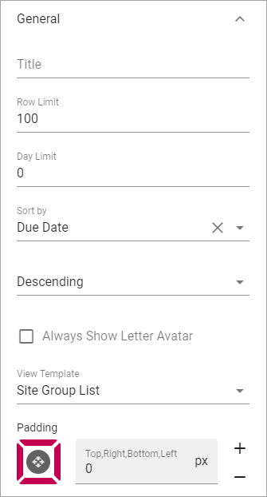
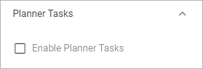

Task Rollup
===========================================

This block can be used to show tasks assigned to the logged in user. Tasks from Team Sites will always be shown. Tasks from Planner can also be added.

All sites with tasks assigned to the user is displayed in a list. Here's an example with the list opened for one of the sites:

.. image:: tasks-rollup-example.png

Settings
*********
The following settings are available:

.. image:: tasks-rollup-settings-new.png

General
---------
The following is availabled here:

+ **Title**: To show a title for the block, add a title here.
+ **Row Limit**: The maximum number of tasks to show in the list.
+ **Day Limit**: How many days forward in time to show assigned tasks. 0 = no limit.
+ **Sort by**: Select which column the list should be sorted on, and then select ascending or descending.
+ **Always Show Letter Avatar**: Select if a letter avatar should always be shown instead of site image.
+ **View Template**: Select View Template here; "Simple list" or "Site Group List".
+ **Padding**: You can add padding between the list and the block border if needed.

Custom colors
----------------
You should primarily set colors in Omnia Admin (System/Settings/Default colors). If you still would like custom colors for the block, you can set them using this tab.

.. image:: tasks-rollup-settings-colors.png

Planner Tasks
---------------
Check the box "Enable Planner Tasks" to include tasks from planner in the Tasks Rollup.

Layout and Advanced
**********************
The tabs Layout and Advanced contain general settings, see: :doc:`General Block Settings </blocks/general-block-settings/index>`

