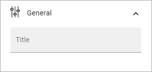

Task rollup
===========================================

This block can be used to show tasks assigned to the logged in user. Tasks from teamsites will always be shown. Tasks from Planner can also be added, if setup in Omnia.

**Note!** In Omnia on-prem, only SharePoint tasks are supported (Planner tasks are not supported).

All sites with tasks assigned to the user is displayed in a list. Here's an example with the list opened for one of the sites:

.. image:: tasks-rollup-example-new2.png

Settings
*********
The following settings are available:

.. image:: tasks-rollup-settings-new4.png

General
---------
Here you can add a Title for the block, if needed:

If variations exists, as is the case in the above image, only one title can be set. In that case, titles in other languages are set in the variations. If no variation exists for the page, it looks like in the image above and you can set the title in the languages active in the tenant. 

Query
--------
For Query, you can set the following:

.. image:: tasks-rollup-settings-query.png

+ **Day limit**: How many days forward in time to show assigned tasks. 0 = no limit.
+ **Enable Planner tasks**: Check the box to include tasks from planner in the Tasks rollup.

Display
----------
These settings are available for Display:

.. image:: tasks-rollup-settings-display.png

+ **Row limit**: The maximum number of tasks to show in the list.
+ **Sort by**: Select which column the list should be sorted on, and then select ascending or descending.
+ **Always show letter avatar**: Select if a letter avatar should always be shown instead of site image.
+ **Open in new window**: Select this option if tasks should be opened in a new window (default=selected).
+ **View template**: Select view template here; "Simple list" or "Site group list".
+ **Padding**: You can add padding between the list and the block border if needed.

Custom colors
----------------
Here you can set custom colors for the block.

.. image:: tasks-rollup-settings-colors-new3.png

Layout and Write
*********************
The WRITE TAB is not used here. The LAYOUT tab contains general settings, see: :doc:`General block settings </blocks/general-block-settings/index>`

