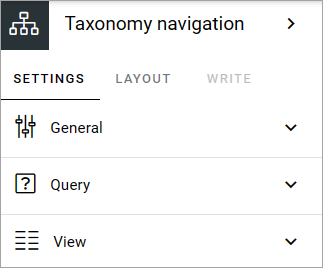
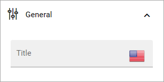
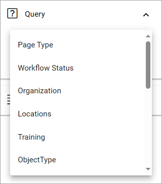
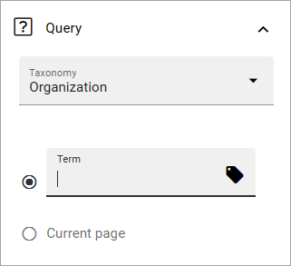
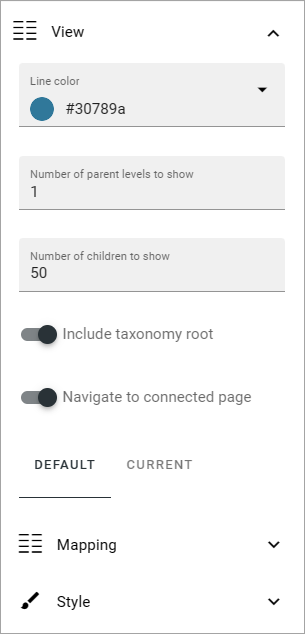
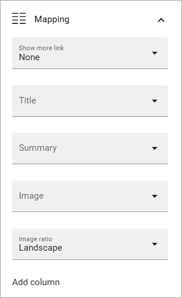
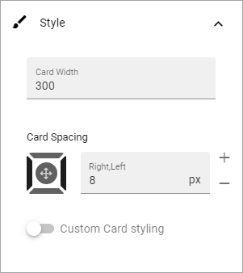
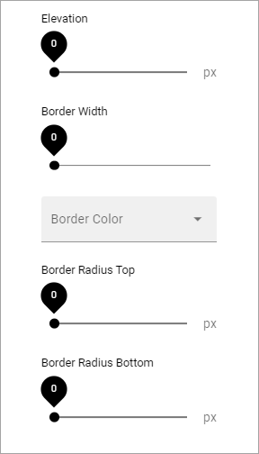

Taxonomy navigation
========================

**This page is being updated.**

In this block you can create taxonomy based navigation. A common area of use is to create an organization chart, but it can be used for many other purposes.

Here's an example:

.. image:: taxonomy-navigation-example.png

**Note!** The taxonomies to be used for navigation must be set up in Enterprise glossary in Omnia admin. See this page for more information: :doc:`Enterprise glossary </admin-settings/tenant-settings/properties/enterprise-glossary/index>`

Settings
*********
The following settings are availble:

General
-----------
Here you can add a title for the block.

Query
---------
Here you select tha taxonomy to be used for navigation.

For several of the taxanomies you must select where to get the term from - or to get it from the current page. 

View
-----------
These settings are available for View:

+ **Line color**: Here you can set color for the lines between levels.
+ **Number of parent levels to show**: Select the number of parent levels to be shown.
+ **Number of children to show**: Select the maximum number of children to be shown, within the parent level(s).
+ **Include taxonomy root**: If the taxonomy root (name) should be shown, select this option.
+ **Navigate to connected page**: If it should be possible to click to go the connected page, select this option.

Default or Current
--------------------
You can set mapping and style for default or current. Current is used if a page is connected to a term, so the term can be clicked to go to the page.

Mapping
---------
Use these settings to map certain areas to which property to get the information from. There are also a few other settings you can use here:

+ **Show more link**: A "Show more" link can be added to the cards by selecting this option. 
+ **Add column**: This lable is wrong. Should be "Add property" (will be changed in system soon). Use it to add additional properties to be shown on the card.

Style
----------
The style settings are these:

General block styling, that is the color and the like, are set in Omnia admin. If you choose "Custom card styling" you can set the following:

.. image:: taxonomy-navigation-settings-style-custom.png

Click the icon to choose a theme.

And furthermore, if you select "Show advanced settings", you can use these settings:

