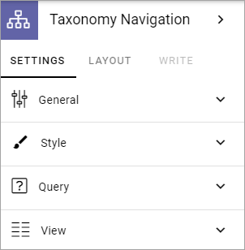
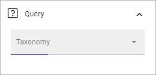
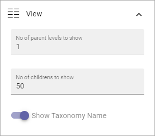

Taxonomy navigation
========================

In this block you can create taxonomy based navigation. The most common area of use is to create an organization chart.

Here's an example:

.. image:: taxonomy-navigation-example.png

**Note!** The taxonomies to be used for navigation must be set up in Enterprise glossary in Omnia admin. See this page for more information: :doc:`Enterprise glossary </admin-settings/tenant-settings/properties/enterprise-glossary/index>`

Settings
*********
The following settings are availble:

General
-----------
Here you can add a title for the block.

.. image:: taxonomy-navigation-settings-general.png

Style
----------
The style settings are these:

.. image:: taxonomy-navigation-settings-style.png

General block styling, that is the color and the like, are set in Omnia admin. If you choose "Custom card styling" you can set the following:

.. image:: taxonomy-navigation-settings-style-custom.png

And furthermore, if you select "Show advanced settings", you can use these settings:

.. image:: taxonomy-navigation-settings-style-custom-advanced.png

Query
---------
Here you select tha taxonomy to be used for navigation.

View
-----------
And finally, some settings for the view are available:

+ **Number of parent levels to show**: Select the number of parent levels to be shown.
+ **Number of children to show**: Select the maximum number of children to be shown, within the parent level(s).
+ **Show taxonomy name**: If the taxonomy name should be shown, select this option.

