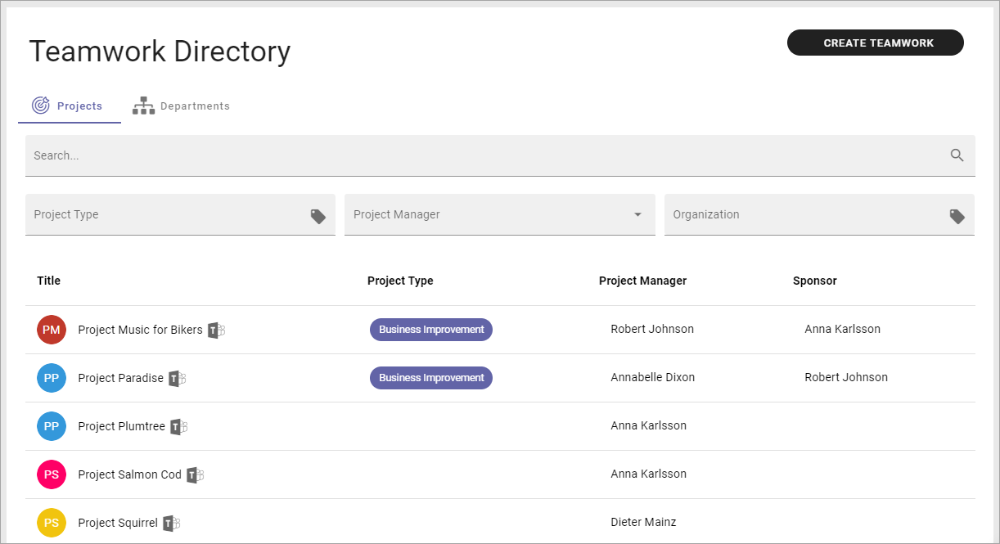
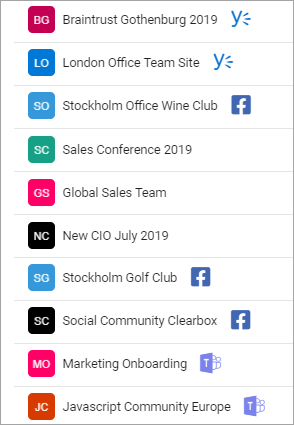
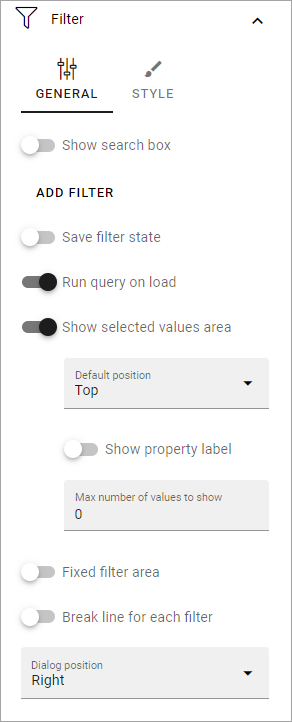

Teamwork Rollup
======================

Use this block to show team sites and other teamworks the user has access to. Here's an example:

Note that icons indicate if a Teams, Yammer or Facebook Workplace group is connected to the Team Site. Users can click the icon to go to the group. In the image above a Teams group is connected to each Team Site.

Here's another example, with all three types of icons:

Settings
*********
The following settings are available for the block:

.. image:: team-collaboration-block-settings-new4.png

General
---------
You can add a title for the block here.

.. image:: teamwork-general-v7.png

If variations exists, only one title can be set. In that case, titles in other languages are set in the variations. If no variation exists for the page, you can set the title in the languages active in the tenant (click the flag to change language).

Query
--------
Here you can set the following (image from Omnia v7): 

.. image:: teamwork-query-new2-7.png

+ **Scope**: Select scope, for example All, Followed or Member of. (See more information about this below.)
+ **Permission**: Available in Omnia 7.0 and later. Used for security trimming. For more information, see: :doc:`Security trimming in app rollups </general-assets/security-trimming-apps/index>`
+ **Only Current Business Profile**: If only Teamworks from the current business profile should be listed, select this option.
+ **Business Profile**: Another option is to select a specific Business Profile. If you do not select any Business Profile, all Teamworks in the tenant can be listed, that is not private.
+ **Site Template**: Here you can set one or more types of teamwork to be shown in the list. 
+ **Run Query On Load**: Decide if the query should be run on load, so the list is filled with teamworks, or not. If a list is very long it can be a good idea to add a search box, and to deselect this option. You add a search box under Filter UI, see below. (In Omnia 7.0 and later, this option is moved to the Filter section).

Regarding Scope, here's more detailed information:

Note that the first three scopes only include teamwork connected to Omnia that are assigned a provisioning template and can be found in the Teamwork list within Omnia admin.

+ All (public): All Teamwork App Instances where "Show in public listings" is checked. (Omnia Database).
+ Followed: All followed Teamwork App Instances. (Omnia Database).
+ Last Visited: All last visited Teamwork App Instances. (Omnia Database).
+ All (SharePoint Sites): All sites in SharePoint. (SharePoint Search).
+ Followed (SharePoint Sites): All followed sites in SP. (SharePoint Social API).
+ Member of (Office 365 Groups): Member of Office 365 Groups (MS Graph).

Display
----------
Select a View (List View or Navigation View) and use the following settings (image from Omnia v7):

.. image:: team-collaboration-block-settings-display-v7.png

(All options are not shown in the image but are described below.)

+ **Add Column**: If you select List View, you must add at least one Column for the display to work. (Navigation View is fixed regarding the columns to display).
+ **Fixed header**: Available in Omnia v7. Select to always show the header when scrolling.
+ **Paging**: Select how paging should work; "No Paging", "Classic" or "Scroll".
+ **Icon Mode**: For Icon Mode you can select Letter Avatar or Template Icon. In the example images at the top, Letter Vatar is selected.
+ **Item Limit**: Set the number of sites to be shown on each "page" of the list.
+ **Sort By**: Select what to sort the list on, and then select Ascending or Descending sorting.
+ **No result text**: You can add a text that is shown if the query should result in nothing to display. Add in any of the avaiable tenant languages (click the flag to change language).
+ **Show Follow status**: Follow status is indicated by a star, filled if the teamwork is followed, hollow if not, see below for an example.
+ **Open in new window**: For some (maybe all) of of the teamworks, it can be a good idea to open the link in a new window.
+ **Padding**: You can add some padding between the block's borders and the list.

Here's an example of a Navigation View with follow status shown:

.. image:: follow-status.png

Filter UI
------------------
Here you can add filters so users can filter (= choose to just see some) of a long list. (Image from Omnia v7).

For more information on how to add filters, or a search box, see this page: :doc:`Filter UI </blocks/general-block-settings/filters/index>`

In Omnia 7.0 and later, new options for filtering can be available, see: :doc:`Filter options for blocks in Omnia 7.0 </blocks/general-block-settings/filter-options-block/index>`

Layout and Write
*********************
The WRITE TAB is not used here. The LAYOUT tab contains general settings, see: :doc:`General Block Settings </blocks/general-block-settings/index>`

