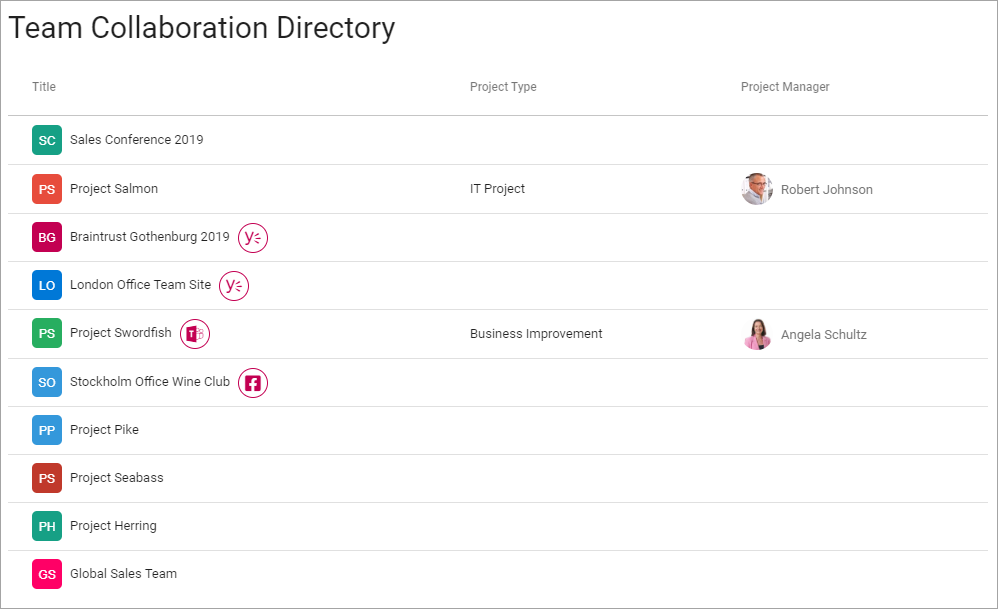
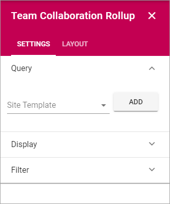
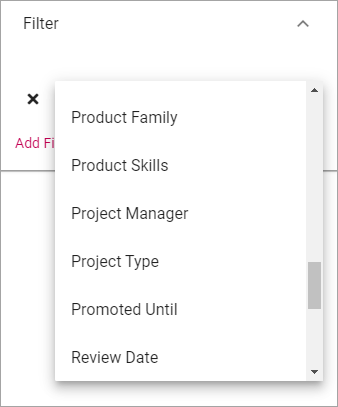
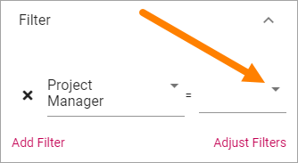

Team Collaboration Rollup
============================

Use this block to show team sites and other collaboration sites the user has access to. Here's an example:

Note that icons indicate if a Teams, Yammer or Facebook Workplace group is connected to the Team Site. Users can click the icon to go to the group.

Here's an example with all three icons present:

.. image:: sitedirectory-icons.png

Settings
************************
The following settings are available for the block:

Query
--------
Here you set the type of sites to be shown in the list. 

1. Select site type.
2. Click "Add",
3. Continue until all types that should be shown in the list are selected, for example:

.. image:: team-collaboration-block-settings-query.png

Display
----------
Select a View and use the following settings:

.. image:: team-collaboration-block-settings-display.png

+ **Add Column**: You must add at least one Column for the display to work.
+ **Title**: Add the title for the list here.
+ **Paging**: Select how paging should work; "No Paging", "Classic" or "Scroll".
+ **Item Limit**: Set the number of sites to be shown on each "page" of the list.
+ **Sort By**: Select what to sort the list on, and then select Ascending or Descending sorting.
+ **Padding**: You can add some padding between the block's borders and the list.

Filter
------------------
Here you can add filters so users can filter (= choose to just see some) a long list.

.. image:: add-filter.png

Do the following:

1. Click "Add Filter".
2. Open the list and select a property to filter on.

**Tip!**: A Search Box is available at the bottom of the property list.

3. Make additional selections for the property if needed.

If there's a metadata list to choose from it can look like this, if you, for example will make it possible to just filter on some of the property's metdata:

.. image:: add-filter-3.png

4. If sorting is needed, click "Adjust Filters" and use the arrows to adjust sorting. (Don't forget to click "Done" when you're finished).

.. image:: adjust-filters.png

Here are a common setup for filters, with a search box and filters for Project Manager, Modified and Project Type:

.. image:: team-rollup-filter-example.png

This setup results in the following:

.. image:: team-rollup-example-2.png

Layout and Advanced
**********************
The tabs Layout and Advanced contain general settings, see: :doc:`General Block Settings </blocks/general-block-settings/index>`

