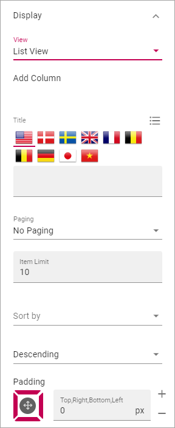
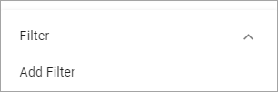
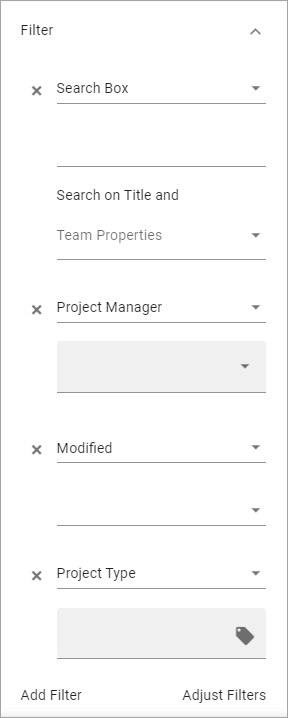
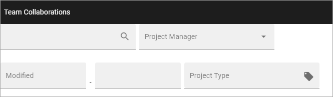

Teamwork Rollup
============================

Use this block to show team sites and other teamworks the user has access to. Here's an example:

.. image:: sitedirectory-g2-new2.png

Note that icons indicate if a Teams, Yammer or Facebook Workplace group is connected to the Team Site. Users can click the icon to go to the group.

Here's an example with all three types of icons:

.. image:: sitedirectory-iconexamples.png

Settings
*********
The following settings are available for the block:

.. image:: team-collaboration-block-settings-new3.png

Query
--------
Here you can set the following:

.. image:: teamwork-query-new.png

+ **Scope**: Select scope, for example All, Followed or Member of.
+ **Site Template**: Here you can set the type of teamwork to be shown in the list. 
+ **Run Query On Load**: Decide if the query should be run on load, so the list is filled with teamworks, or not. If a list is very long it can be a good idea to add a search box, and to deselect this option. You add a search box under Filter UI, see below. 
+ **Enable partial word search**: If enabled, the query can find parts of words, if not enabled, just whole words. 

Display
----------
Select a View (List View or Navigation View) and use the following settings:

+ **Add Column**: If you select List View, you must add at least one Column for the display to work. (Navigation View is fixed regarding the columns to display).
+ **Title**: If a title should be shown for the block, add it in this field. If no variation exists for the page, it looks like in the image above and you can set the title in the languages active in the tenant. If variations exists, only one title can be set. In that case, titles in other languages are set in the variations.	.
+ **Paging**: Select how paging should work; "No Paging", "Classic" or "Scroll".
+ **Icon Mode**: For Icon Mode you can select Letter Avatar or Template Icon. In the example images at the top, Letter Vatar is selected.
+ **Item Limit**: Set the number of sites to be shown on each "page" of the list.
+ **Sort By**: Select what to sort the list on, and then select Ascending or Descending sorting.
+ **Padding**: You can add some padding between the block's borders and the list.
+ **Show Follow status**: Follow status is indicated by a star, filled if the teamwork is followed, hollow if not, see below for an example.
+ **Open in new window**: For some (maybe all) of of the teamworks, it can be a good idea to open the link in a new window.

Here's an example of a Navigation View with follow status shown:

.. image:: follow-status.png

Filter UI
------------------
Here you can add filters so users can filter (= choose to just see some) of a long list.

Here is a common setup for filters, with a search box and filters for Project Manager, Modified and Project Type:

This setup results in the following:

For more information on how to add filters, or a search box, see this page: :doc:`Filter UI </blocks/general-block-settings/filters/index>`

Layout and Advanced
**********************
The tabs Layout and Advanced contain general settings, see: :doc:`General Block Settings </blocks/general-block-settings/index>`

