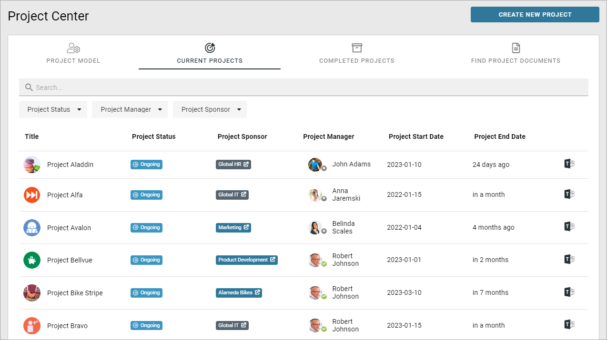
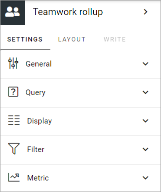
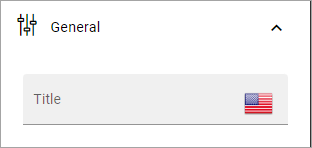
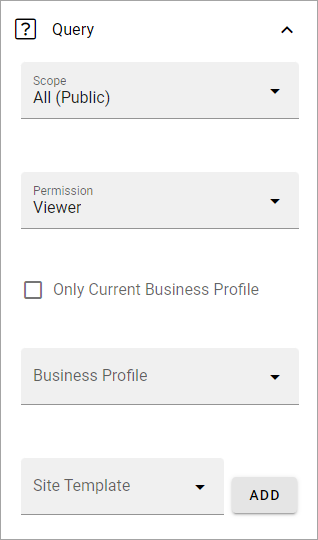
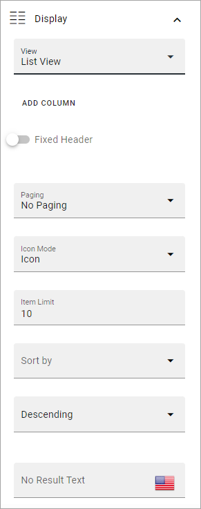
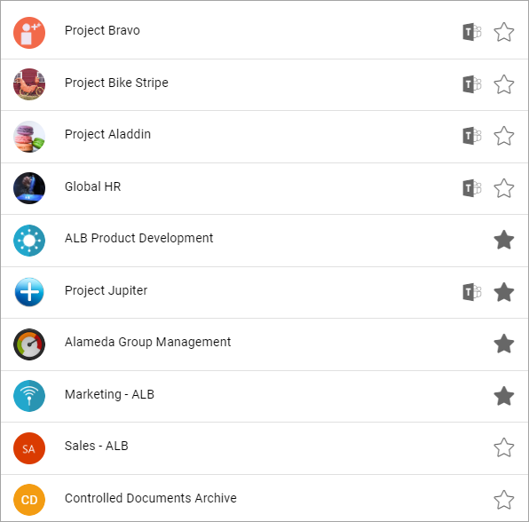
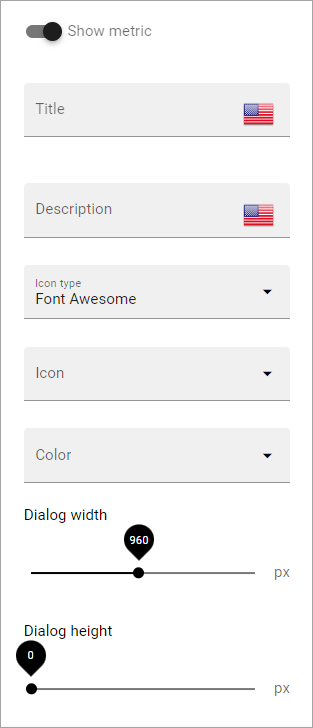

Teamwork rollup
======================

Use this block to show team sites and other teamworks the user has access to. Here's an example when the block is used to rollup projects (projects are teamworks) in Omnia v7:

Note the metadata for project status and project sponsor.

Icons indicate if a Teams group, Viva Engage (former Yammer) or Facebook workplace group is connected to the teamsite. Users can click the icon to go to the group. In the image above a Teams group is connected to each team site.

Settings
*********
The following settings are available for the block (image from Omnia 7.5):

General
---------
You can add a title for the block here, in any tenant language.

Query
--------
Here you can set the following: 

+ **Scope**: Select scope, for example All, Followed or Member of. (See more information about this below.)
+ **Permission**: Available in Omnia 7.0 and later. Used for security trimming. For more information, see: :doc:`Security trimming in app rollups </general-assets/security-trimming-apps/index>`
+ **Only current business profile**: If only teamworks from the current business profile should be listed, select this option.
+ **Business profile**: Another option is to select a specific business profile. If you do not select any business profile here, all teamworks in the tenant can be listed, that is not private.
+ **Site template**: Here you can set one or more types of teamwork to be shown in the list. 

Regarding Scope, here's more detailed information:

Note that the first three scopes only include teamwork connected to Omnia that are assigned a provisioning template and can be found in the Teamwork list within Omnia admin.

+ All (public): All teamwork app instances where "Show in public listings" is checked. (Omnia database).
+ Followed: All followed teamwork app instances. (Omnia database).
+ Last visited: All last visited teamwork app instances. (Omnia database).
+ All (SharePoint sites): All sites in SharePoint. (SharePoint search).
+ Followed (SharePoint sites): All followed sites in SharePoint. (SharePoint social API).
+ Member of (Office 365 groups): Member of Office 365 groups (MS Graph).

Display
----------
Select a view (List view or Navigation view) and use the following settings (image from Omnia v7):

(All options are not shown in the image but are described below.)

+ **Add column**: If you select List View, you must add at least one Column for the display to work. (Navigation view is fixed regarding the columns to display).
+ **Fixed header**: Select to always show the header when scrolling.
+ **Paging**: Select how paging should work; "No paging", "Classic" or "Scroll".
+ **Icon mode**: For Icon mode you can select "Letter avatar" or "Template icon". In the example images at the top, Letter avatar is selected.
+ **Item limit**: Set the number of sites to be shown on each "page" of the list.
+ **Sort by**: Select what to sort the list on, and then select Ascending or Descending sorting.
+ **No result text**: You can add a text that is shown if the query should result in nothing to display. Add in any avaiable tenant language.
+ **Show follow status**: Follow status is indicated by a star, filled if the teamwork is followed, hollow if not, see below for an example.
+ **Open in new window**: For some (maybe all) of of the teamworks, it can be a good idea to open the link in a new window.
+ **Padding**: You can add some padding between the block's borders and the list.

Here's an example of a Navigation view with follow status shown (image from Omnia v7):

Filter
------------------
Filter options are the same in most blocks. For more information, see: :doc:`Filter options for blocks </blocks/general-block-settings/filter-options-block/index>`

Metric
------------
Using these settings you can show a metric in the block displaying the number of teamwork that is valid for the query settings. The metric can then be clicked to display the teamwork rollup you have set up.

This can for example be used to create a rather compact page or section with different metrics in different blocks. The user can then click the desired metric to see the full list.

+ **Show metric**: Select this to decide to show the metric (and the settings below becomes available).
+ **Title**: Add a title for the metric if needed.
+ **Description**: A description for the metric can also be added.
+ **Icon type/Icon**: Select an icon type and an icon, if you want to.
+ **Color**: This sets the color for the divider above the metric. 
+ **Dialog width/height**: Set width and height for the dialog displaying the list of pages.

Layout and Write
*********************
The WRITE TAB is not used here. The LAYOUT tab contains general settings, see: :doc:`General block settings </blocks/general-block-settings/index>`

