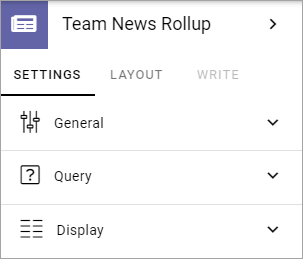
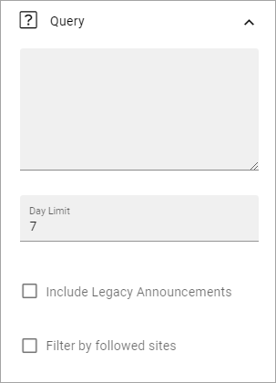

Team News Rollup
===========================================

Use this block to show team news for the logged in user. Here's a simple example of how it can look:

.. image:: team-news-example-1-new.png

The user can click the team to see a list of news items from that team, for example (with dummy text):

.. image:: team-news-example-2-new.png

Block Settings
****************
The following settings are available:

General
---------
Under General, you can add a title for the block:

.. image:: team-news-rollup-settings-general.png

Query
-------
The following settings are available here:

Use the top field to add a custom query. The custom query can be used to only show team news with certain properties. It can also be used to include or exclude certain sites. In the example below, it is used to exclude all news from Communication Sites:

.. image:: team-news-rollup-settings-query-exmple.png

+ **Day Limit**: Set the number od days a team news should be displayed here, from the day it's pubslihed.
+ **Include Legacy Announcements**: If you're using the earlier Omnia solution for Team Announcements, select this option to show them here.
+ **Filter by followed sites**: If team news only from the sites the user follows should be shown, select this option.

Display
---------
Here, the following can be set:

.. image:: team-news-rollup-settings-display.png

+ **Row Limit**: Decide the number of rows to show for each "page" of the list.
+ **View**: Select view for the list; "List" or "Grouped by site".
+ **Order By**: Select what to sort the lists by.
+ **Show thumbnail image**: If a thumbnail image should be shown for the news post, select this option.
+ **Padding**: You can add some padding between the list and the block border if needed.

Layout and Write
**********************
The Write tab is not used here. The Layout tab contains general settings, see: :doc:`General Block Settings </blocks/general-block-settings/index>`

