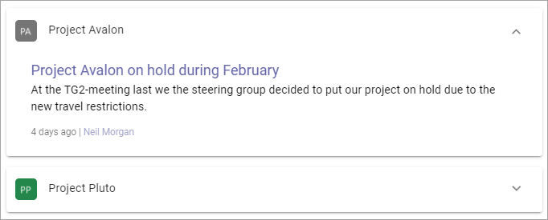
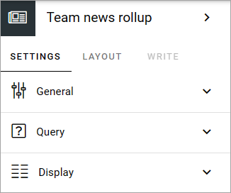
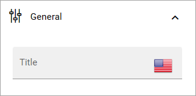
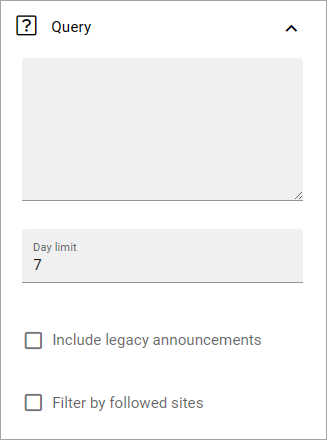
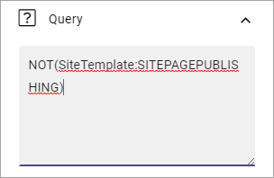
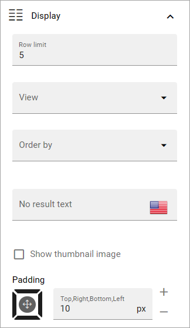

Team news rollup
===========================================

Use this block to show team news for the logged in user. Here's a simple example of how it can look:

.. image:: team-news-example-1-new.png

The user can click the team to see a list of news items from that team, for example (with dummy text):

Block Settings
****************
The following settings are available:

General
---------
Under General, you can add a title for the block in any tenant language:

Query
-------
The following settings are available here:

Use the top field to add a custom query. The custom query can be used to only show team news with certain properties. It can also be used to include or exclude certain sites. In the example below, it is used to exclude all news from communication sites:

+ **Day limit**: Use this settings for how old a news article should be to be displayed here. It's counted from the day it's published.
+ **Include legacy announcements**: If you're using the older Omnia solution for team announcements, select this option to show them here.
+ **Filter by followed sites**: If team news only from the sites the user follows should be shown, select this option.

Note that you can type the script directly in the field, if you know how. You can use all options in the Keyword Query Language (KQL). See this Microsoft page for reference: https://docs.microsoft.com/en-us/sharepoint/dev/general-development/keyword-query-language-kql-syntax-reference

Display
---------
Here, the following can be set:

+ **Row limit**: Decide the number of rows to show for each "page" of the list.
+ **View**: Select view for the list; "List" or "Grouped by site".
+ **Order by**: Select what to sort the lists by.
+ **No result text**: If you would like a specific text to be shown when there are no news to display, add the text here, in any tenant language.
+ **Show thumbnail image**: If a thumbnail image should be shown for the news post, select this option.
+ **Padding**: You can add some padding between the list and the block border if needed.

Layout and Write
**********************
The Write tab is not used here. The Layout tab contains general settings, see: :doc:`General block settings </blocks/general-block-settings/index>`

