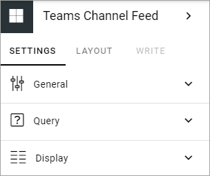
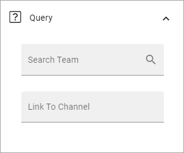

Teams Channel Feed
====================

This is an ongoing, preliminary documentation of a new block that will be available in Omnia 6.5. 

As the name indicates, you can use the block to display a Teams Channel Feed. The feed will be read only.

The following settings are available:

General
************
Under General you can set a title for the block, in any or all tenant languages (click the flag top change language).

.. image:: teams-channel-settings-general.png

Query
*******
The Query settings will be these:

+ **Search Team**: Select the Team here.
+ **Channel List**: Select channel for the team here.
+ **Link to Channel**: Another option is to add the link to the channel in this field. (You then don't have to add the above.)

Display
**********
For Display, the following will be available:

.. image:: teams-channel-settings-display.png

+ **Sorting**: You can choose to list the newer items first, or the older items first.
+ **Item Limit**: Set the number of items to be shown in the list before a See more icon is shown.

