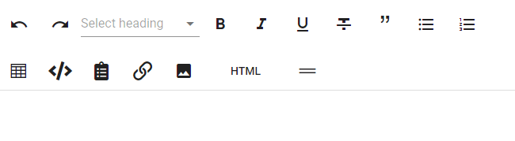
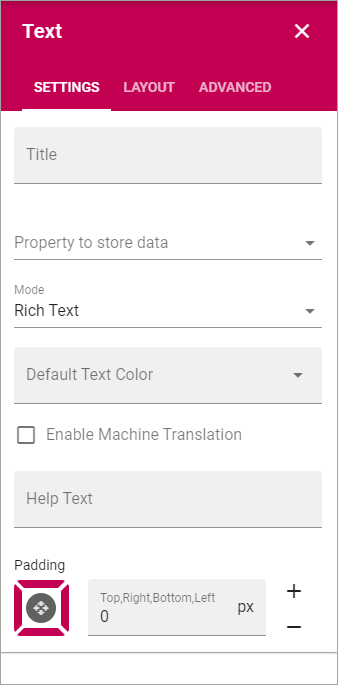

Text
===========================================
Use this block to add text anywhere on a page. 

When adding text to the block some basic formatting is available:

Point at an icon and a Tool Tip will show what the option is for.

Note that HTML editing is done in a separate window so it's to work with HTML if that is something you want.

Settings
*********
The following settings are available for the block:

+ **Title**: To add a title for the block, type the title here.
+ **Property to store data**: Select type of text to be used in this block; Title, Page Content or Page Summary. When one block on the page has data connected to a Property, that data can be reused in all blocks that uses the same Property. Page scoped. Not mandatory.
+ **Mode**: Select mode for the text; Plain Text, Multi-line Plain Text, Limited Rich Text or Rich Text. For some properties, just some of the modes are available. When selecting "Limited Rich Text" or "Rich Text" you can select format for the text when working with the text in the block. When selecting "Plain text" or "Multiline Plain text" you can select a format for all text in the block.

.. image:: text-setting-format.png

+ **Enable Machine Translation**: (A descirption will be added soon.)
+ **Help text**: Here you can add a help text for the editor, for example to make it clear what kind of content should be added to the block. The help text is shown when no content is added, and when the block is edited. The help text is never shown to users as it's not shown for a published version of the page.

Here's an example of help text:

.. image:: help-text.png

+ **Padding**: You can set some padding around the text if needed.

Layout and Advanced
**********************
The tabs Layout and Advanced contain general settings, see: :doc:`General Block Settings </blocks/general-block-settings/index>`

