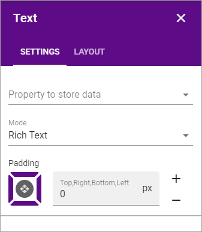

Text
===========================================
Use this block to add text anywhere on a page. 

Settings
*********
The following settings are available for the block:

+ **Property to store data**: Select type of text to be used in this block; Title, Page Content or Page Summary.
+ **Mode**: Select mode for the text here; Plain Text, Multi-line Plain Text, Limited Rich Text or Rich Text. For some properties, just some of the modes are available. When selecting "Plain Text" or "Multi-line PLain Text" you can select format for the text.

.. image:: text-setting-format.png

+ **Padding**: You can set some padding around the text if needed.

