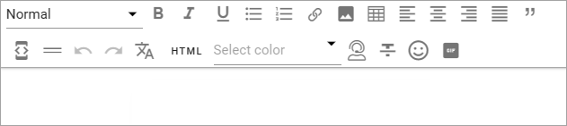
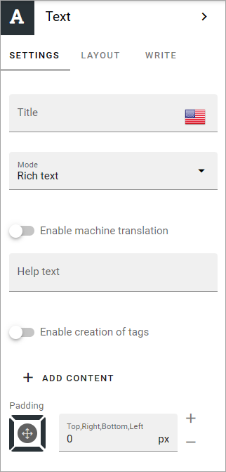
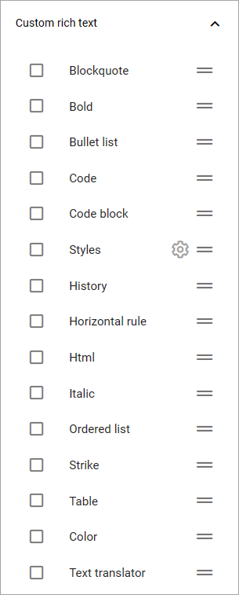
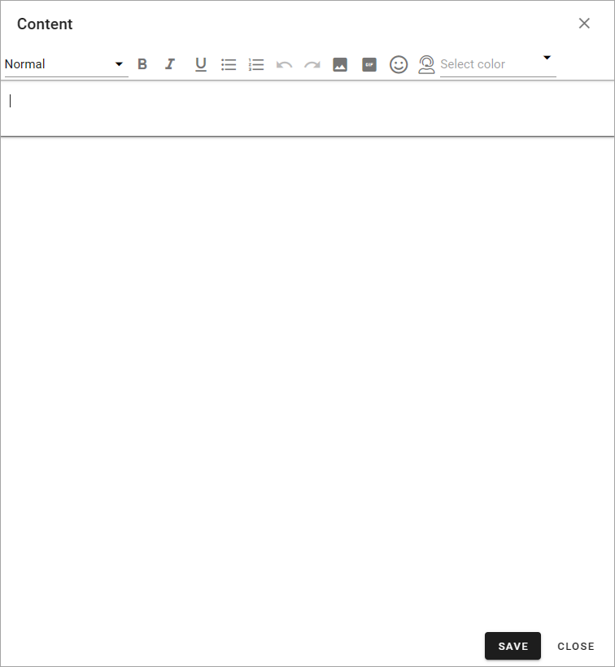

Text
=============
Use this block to add text anywhere on a page. You can use it just to add a container an editor can to add text to, or you can add some default text an editor can edit using Write mode, or text that editors can't edit.

When adding text to the block some basic formatting can be available, depending on the type of text set for the block. Here's an example with the formatting options for rich text:

Point at an icon and a tool tip will show what the option is for.

See this page for more information on how to use the RTF editor: :doc:`RTF editor </general-assets/rtf-editor/index>`

Available options for Rich Text is set up in Omnia admin, see: :doc:`RTF editor settings </admin-settings/tenant-settings/settings/rtf-editor/index>`

Settings
*********
The following settings are available for the block:

+ **Title**: If a title should be shown for the block, add it in this field, in any tenant language.
+ **Mode**: Select mode for the text. For plain text and multi-line plain text there are no formatting available. For more information on custom rich text, see below.
+ **Formatting**: Select the default style here. Available for plain text and multi-line plain text.
+ **Enable machine translation**: When using a variation with automatic translation, you can decide which blocks should be automatically translated (and not) - all blocks that has this option selected will be automatically translated using machine translation for the variation. See below for links to more information. **Note!** Machine translation is not available in Omnia on-prem. 
+ **Help text**: Here you can add a help text for the editor, for example to make it clear what kind of content should be added to the block. The help text is shown when no content is added, and when the block is edited. The help text is never shown to users as it's not shown for a published version of the page. Not available for plain text. 
+ **Enable creation of tags**: When this option is selected, any #tag that is added in the text block will be set in the configured corresponding property.
+ **Enable automatic summary**: Available for multi-line text and when this option is activated for OpenAI (Omnia v7). For this to work you must also set the property to get the source text from.
+ **Source property**: Available when "Enable automatic summary" is selected. Choose the property for the source text, for the summary.
+ **ADD CONTENT**: Click here if you want to add some default content to the block. (also see below).
+ **Padding**: You can set some padding around the text if needed.

For more information on how machine translation works, see the RTF editor description (see link above).

For more information about automatic translation, see the heading "Create a new variation" om this page: :doc:`Publishing app settings </pages/page-settings/index>`

Custom rich text
-----------------
If you select "Rich text" or "Limited rich text", the text tools include only those set up in Omnia admin. 

When you select "Custom rich text" you can set the text tools that should be available in this block, from the tools available for rich text. Open "Custom rich text" that now becomes available at the bottom of the settings window:

**Note!** Not all options are shown in the image.

You work with these settings exactly the same way as when they are set up in Omnia admin, see :doc:`RTF editor settings </admin-settings/tenant-settings/settings/rtf-editor/index>` 

Add default content
--------------------
When you click "ADD TEXT" the following is shown:

Add the default content and save.

Using the WRITE tab you can set if it should be possible for editors to overwrite the default content or not, see below.

Layout
********
The LAYOUT tab contains general settings, see: :doc:`General block settings </blocks/general-block-settings/index>`

Write
******
Using the WRITE tab you can set the following:

.. image:: text-block-write-v75.png

+ **Enable overwrite in Write mode**: If it should be possible for editors to overrite the default content in the block, this option should be on. If not, click to set the option to off.
+ **Property to store data**: Select type of text to be used in this block; Title, Page content or Page summary. When one block on the page has data connected to a property, that data can be reused in all blocks that uses the same property. Page scoped. Not mandatory.

