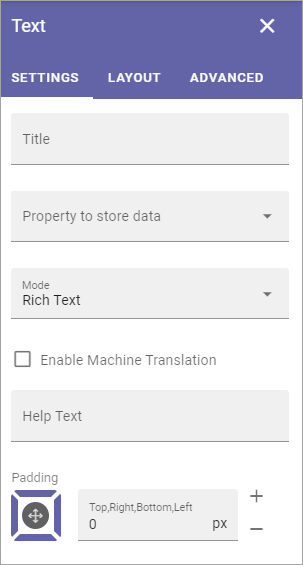

Text
=============
Use this block to add text anywhere on a page. The text block can be edited by any page editor using the Write mode.

When adding text to the block some basic formatting is available. Here's an example with the formatting options for Rich Text:

.. image:: text-formatting-rich-new.png

Point at an icon and a Tool Tip will show what the option is for.

See this page for more information on how to use the RTF Editor: :doc:`RTF Editor </general-assets/rtf-editor/index>`

Available options for Rich Text is set up in Omnia Admin, see the heading "RTF Editor" on this page: :doc:`Tenant Settings </admin-settings/tenant-settings/settings/index>`

Settings
*********
The following settings are available for the block:

+ **Title**: If a title should be shown for the block, add it in this field. If no variation exists for the page, it looks like in the image above and you can set the title in the languages active in the tenant. If variations exists, only one title can be set. In that case, titles in other languages are set in the variations.
+ **Property to store data**: Select type of text to be used in this block; Title, Page Content or Page Summary. When one block on the page has data connected to a Property, that data can be reused in all blocks that uses the same Property. Page scoped. Not mandatory.
+ **Mode**: Select mode for the text. For more information on Custom Rich Text, see below.
+ **Formatting**: Select the default style here. Available for Plain Text and Multi-line Plain Text.
+ **Enable Machine Translation**: If machine translation should be available for this text block, select this option.
+ **Help text**: Here you can add a help text for the editor, for example to make it clear what kind of content should be added to the block. The help text is shown when no content is added, and when the block is edited. The help text is never shown to users as it's not shown for a published version of the page.

Here's an example of help text:

+ **Padding**: You can set some padding around the text if needed.

Custom Rich Text
-----------------
If you select Rich Text or Limited Rich Text, the text tools includ eonly those set up in omnia Admin: 

When you select Custom Rich Text you can set the text tools that should be available in this block, from the tools available in Rich Text. Open settings that now becomes available at the bottom of the settings window:

.. image:: custom-rich-text-new.png

**Note!** Not all options are shown in the image.

You work with these settings exactly the same way as when they are set up in Omnia Admin, see link above. 

Layout and Advanced
**********************
The tabs Layout and Advanced contain general settings, see: :doc:`General Block Settings </blocks/general-block-settings/index>`

