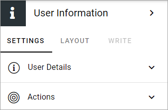
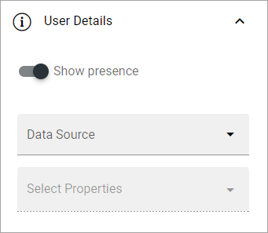
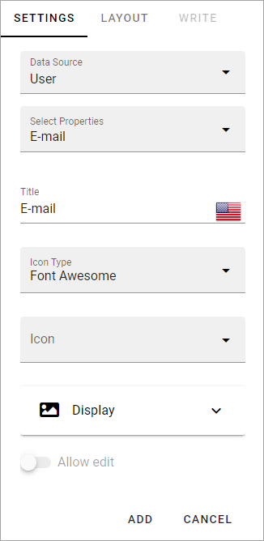
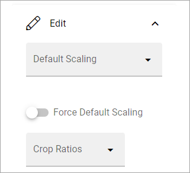
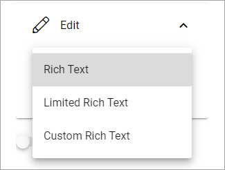
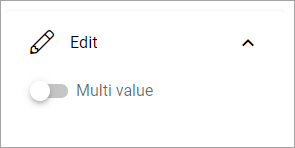
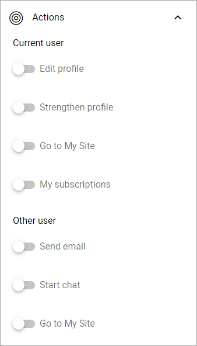

User Information
================================================

Use this block to display user information, for example useful when creating a custom user profile card. This block is available in Omnia 7.0 and later.

Settings
**************
The following settings are available:

User details
*****************
Here you can set:

Different options can be available depending on data source. These are the most commmon. Also see below.

+ **Show presence**: Decide to show the user's Teams presence or not. Default: on.
+ **Data source**: Choose where to get the user information from; App, Page, User, User (Microsoft Graph) or User (Sharepoint). For use on a custom user profile card, the three "User" sources are the most applicable. User means Omnia User setup in User Managment. For use on a page are probably App or Page the most applicable sources.
+ **Select Properties**: When you have selected data source, choose one or more properties to display. Note that different sets of properties are available depending on source chosen and some properties may require additional settings.
+ **Property Type Converter**: If needed, this option is shown. Use it to select property type to use for the selected property in this block. Several properties can for example be either Text or Multi-value text, but that's one simple example. Note that you must select property type here, if this option is shown, for the correct settings to be available below.

Settings for a property
-------------------------
Besides "Property Type Converter", explained above, several other settings can be available for a property. Here are som common ones:

+ **Title**: if you would like to show another title for this property, add that title here.
+ **Icon Type/Icon**: If an icon should be shown for the property, use these two fields to select icon. You also must choose to display the icon, see below.
+ **Display**: Here you select to show label text, the label icon, and for a few properties "Text only" (meaning no icon or image), or not. Default=not.
+ **Allow edit**: For some properties you can allow the logged in user to edit the content in the property.
+ **ADD/CANCEL**: When you're finished with the settings, don't forget to add the property to the block.
 
Additional settings for image and more
-------------------------------------------------
For property type image, additonal settings are available:

+ **Default Scaling**: You can select a default scaling here, but if you don't force (se below) it can be changed when an image is added. Possible scalings are set up in Omnia Admin.
+ **Force Default Scaling**: Use this setting to see to that all images are scaled the same when they are added - using the default scaling. With this option selected, page editors and authors can not select scaling and the dialog "This image has a bigger file size than recommended" is not shown.
+ **Crop Ratios**: Use this list to set up which Crop Ratios editors should be able to choose from in this block. Possible scalings are set up in Omnia Admin.

For some property types, you may be able to select the edit text mode that should be available: Rich Text, Limited Rich Text or Custom Rich Text. If applicable, this option will be availble under Edit.

If it's possible to convert to the property type "Term Set", you must use Setup to map the term set, or it won't work.

.. image:: user-information-property-settings-termset.png

Also note that for some properties it can be possible to use Edit to select Multi value.

Actions
*************
Here you can select some actions to be available as links. Default=none. Note that there are actions only the current user (the user shown on the card) can use, and actions for all other users. 

LAYOUT and WRITE
******************
The WRITE tab is not available for this block. The LAYOUT tab contains general block settings, see: :doc:`General Block Settings </blocks/general-block-settings/index>`

