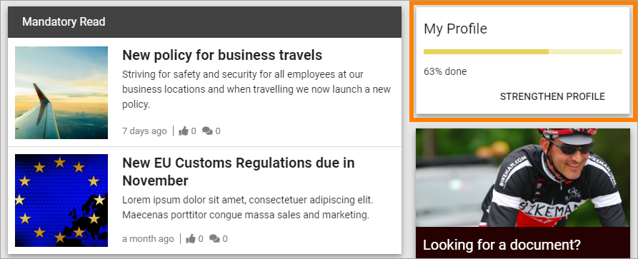

User Profile Completion
==========================

Use this block to show the logged in user how far he or she has come towards completion of the profile. Here's an example:

The user can click "Strengthen Profile" to add additional information.

Settings
***********************
The settings available for the block are general settings only, through the Layout and Advanced tabs, see: :doc:`General Block Settings </blocks/general-block-settings/index>`

All settings for the Strengthen Profile content are done in Omnia Admin, see: :doc:`User Profile Settings </admin-settings/tenant-settings/user-profile-completion/index>`

