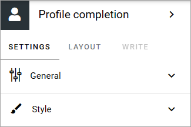
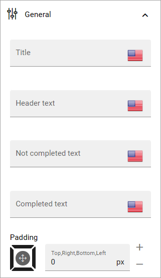
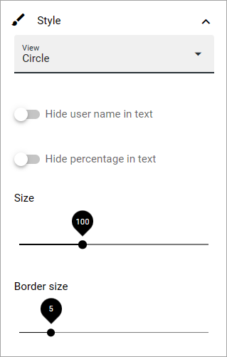

Profile completion
==========================

Use this block to show the logged in user how far he or she has come towards completing the profile. 

Settings
***********************
The following settings are available:

General
--------
Here you can add some texts for the block, and set some padding:

You can add the texts in any tenant language.

Style
------
Use this tab to select style for the percentage. If you select Line, there's nothing more to it. If you select Circle, you can set:

+ **Hide user name in text**: To not show the user name in the block, select this option.
+ **Hide percentage in text**: To not show the percentage in the text, select this. Note that the percentage is still shown in the circle.
+ **Size**: Select the size of the circle using this slider.
+ **Border size**: Select the thickness of the circle border using this slider.

Layout and Write
*********************
The WRITE Tab is not used here. The LAYOUT tab contains general settings, see: :doc:`General block settings </blocks/general-block-settings/index>`

Settings in Omnia Admin
**************************
All settings for the Strengthen Profile content are done in Omnia Admin. There you, for example, can set that a dialog should be shown in certain intervals, prompting the user to complete his or her profile.

For more information about the settings in Omnia admin, see: :doc:`User profile completion </admin-settings/tenant-settings/settings/user-profile-completion/index>`

