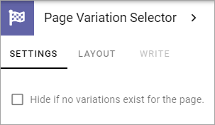

Page Variation Selector
=========================

Use this block to make it possible for end users to select a variation of the page. For more information about Page Variations, see: :doc:`Publishing App Settings </pages/page-settings/index>`

Here's an example of the block placed in a section at the top of the page, in this case part of the Page Type:

.. image:: page-variation-selector-new2.png

The block will simply show a list of the available Page Variations when opened.

Settings
**********
The only setting that can be done for the block is this:

+ **Hide if no variations exist for the page**: Select if the block should be hidden if not variations exist for the page, or if it should always be shown. 

If the block is part of a Page Type this setting can't be edited.

Layout and Write
*********************
The WRITE Tab is not used here. The LAYOUT tab contains general settings, see: :doc:`General Block Settings </blocks/general-block-settings/index>`