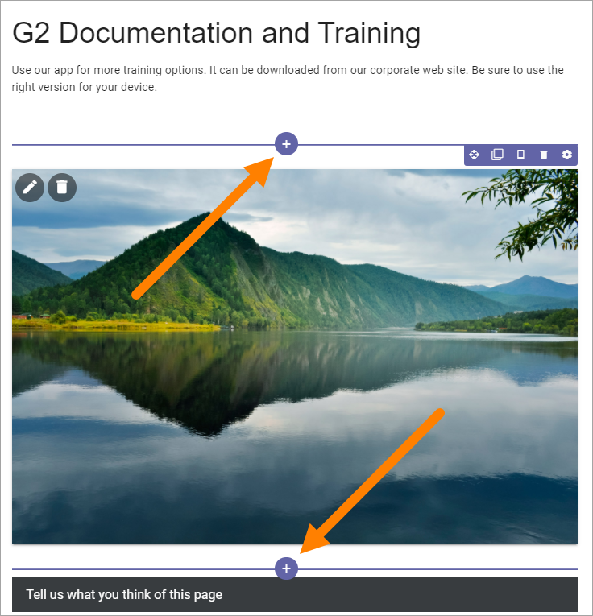
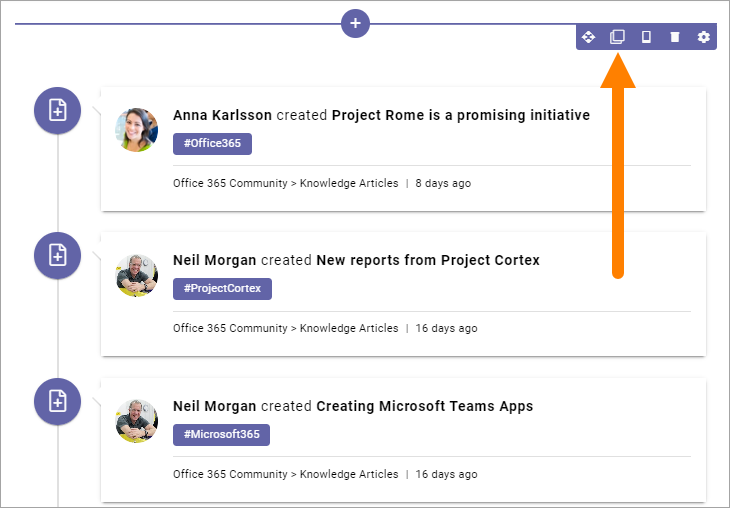
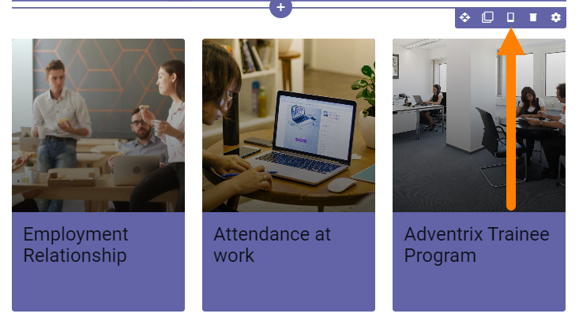
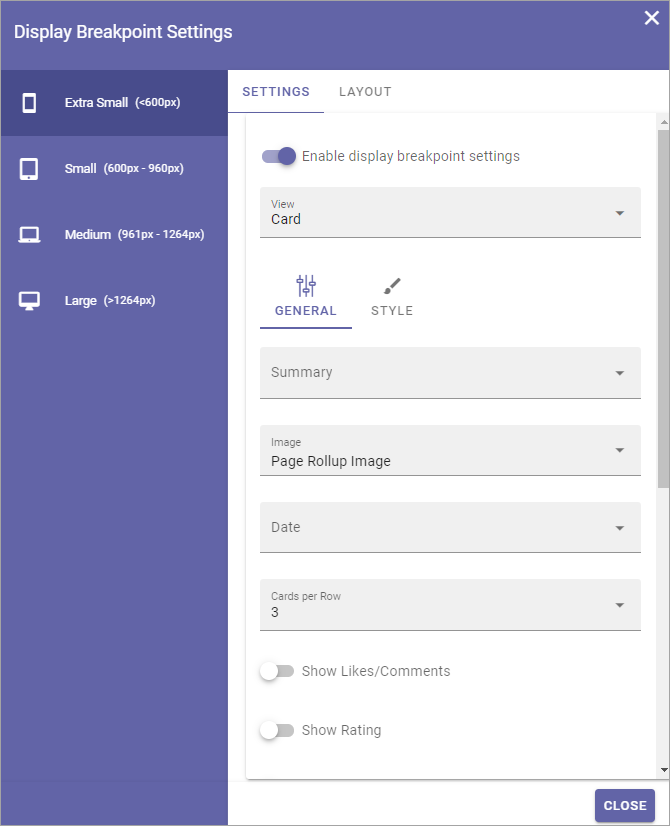
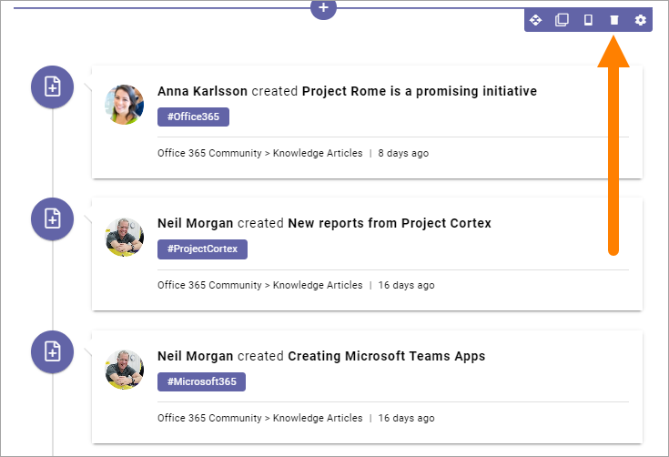
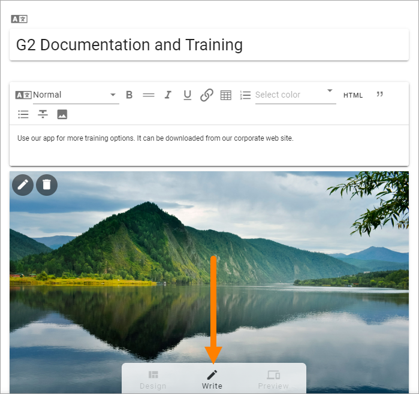

Working with blocks on pages
===============================

This documentation mainly contains general information about how to work with blocks in Design mode on publishing pages (but also see information about Write mode at the bottom).

For more information about how to work with blocks in a page type, see: :doc:`Sections and blocks in page types </pages/page-types/working-with-sections-and-blocks/index>`

Adding blocks
**************
To add a block to a page, do the following:

1. Edit the page in Design mode.
2. Click on the block that will be before or after the new block so you can se the pluses, and click on the appropriate one (the top one to place the new block above or the bottom one to place the block below).

3. Find the block you want to add and select it.

.. image:: block-select-new.png

Editing a block's settings
***************************
To edit a block's settings, do the following:

1. Click the block.
2. Click the cog wheel for the block, for example:

.. image:: edit-block-settings-new2.png

Information about how to change specific settings for a block is found in the block's detailed description.

Moving a block
***************
Do the following to move a block to another place on the page.

1. Click the block.
2. Click the Move icon.

.. image:: move-icon-new2-2.png

Icons now show where you can move the block, for example:

.. image:: block-can-be-moved-new2.png

3. Click the icon where you want the block and it's moved there.

Copying a block
****************
If you need a block with roughly the same settings somewhere else on the page, you can place a copy where you want it, and then edit the settings. Do the following:

1. Click the block.
2. Click the Copy icon.

Icons now show where you can place the copied block, the same way as when you move a block, see above.

3. Click the icon where you want the copied block and it's placed there.
4. Edit the settings that you want to change.

Copy a block from the clipboard
---------------------------------------------
There's also a clipboard available, that can be used to copy blocks between pages or page types, see: :doc:`Clipboard for sections and blocks </general-assets/layout-explorer/clipboard-sections-blocks/index>`

Display settings for blocks
******************************
When you're working on a block you can select how to show it on different devices, or to not display the block at all on some devices.

Click this icon:

Depending on which block it is, there can be some settings available (if not this is empty).

To access the settings, click Enable display breakpoint settings.

.. image:: device-settings-edit-new2.png

The settings are now shown, for example:

You edit the settings the same way as you do in the block's settings, see the description of the block, but here the settings apply specifically to the selected device.

Show the block or not on different devices
-------------------------------------------
Using the LAYOUT settings you can decide on which devices to not show this block at all.

1. Click LAYOUT.
2. Click the pen to change settings.

.. image:: device-support-pen.png

2. Click to hide the block on this device, or if hidden, click to no longer hide.

.. image:: device-click-enable-new.png

Removing a block
*****************
To remove a block. do the following:

1. Click the block.
2. Click the dust bin to remove the block:

**Note!** A block that belongs to the page type is locked and can not be removed, nor edited (but also see below). It is shown this way:

.. image:: locked-block-new4.png

Unlock a block
*******************
It can be possible to unlock a block, if the page type allow it. If it's possible, the settings can then be edited, but the block can still not be moved or deleted.

If a block can be unlocked, there's a small dot in in the lock icon. Click the lock icon to unlock.

.. image:: block-unlock.png

The following is then shown:

.. image:: block-unlock-unlock.png

If you click OK the settings can be edited for that block.

Editing contents of a block
****************************
To work with blocks as is described above a user needs permissions to use Design mode (Editor). Page authors are not allowed to use Design mode, but can use Write mode to edit the contents of some blocks.

Examples of blocks where the contents can be edited using Write mode:

+ Banner
+ HTML/Script
+ Media
+ Related Links
+ Text

