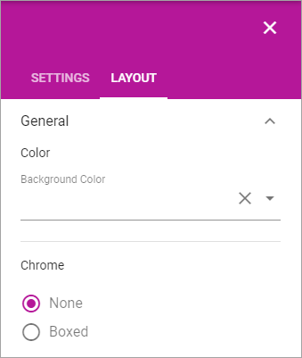
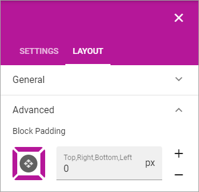

Working with blocks
=====================
This page contains general information about how to work with blocks.

Editing a block's settings
**************************
To edit a block's settings, do the following:

1. Edit the page in Design mode.
2. Click the block.
3. Click the cog wheel for the block, for example:

.. image:: edit-block-settings.png

The Layout tab
***************
The Layout tab is general for all blocks:

.. image:: layout-tab.png

General
--------
Here you cen set the following:

+ **Background Color**: Use this option to set a custom background color for the block.
+ **Chrome**: You can select "None" for no box or "Boxed" to box in the block.

Advanced
---------
Using "Advanced" you can add some padding around the contents of the block.

