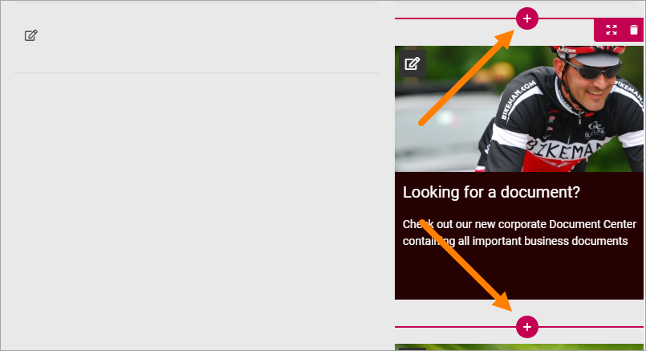
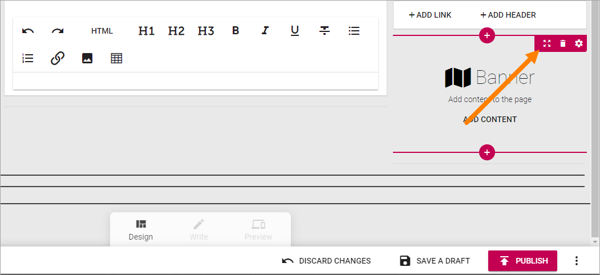
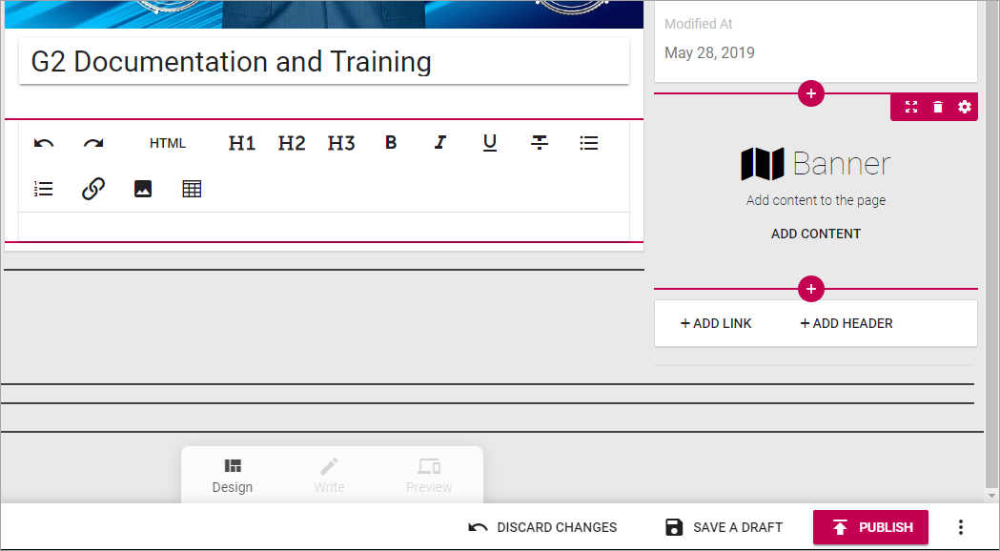

Working with blocks
=====================
This page contains general information about how to work with blocks.

Adding blocks
**************
To add a block to a page, do the following:

1. Edit the page in Design Mode.
2. Click on the block that will be before or after the new block so you can se the pluses, and click on the appropriate one (the top one to place the new block above or the bottom one to place the block below).

3. Find the block you want to add and select it.

.. image:: block-select.png

Editing a block's settings
**************************
To edit a block's settings, do the following:

1. Edit the page in Design Mode.
2. Click the block.
3. Click the cog wheel for the block, for example:

.. image:: edit-block-settings.png

Information about how to change specific settings for a block is found in the block's detailed description.

Moving a block
***************
Do the following to move a block.

1. Click the block.
2. Click the Move icon.

Icons now show where you can move the block, for example:

3. Click the icon where you want the block and it's moved there.

Removing a block
*****************
To remove a block. do the following:

1. Edit the page in Design Mode.
2. Click the block.
3. Click the dust bin to remove the block:

.. image:: block-remove.png

