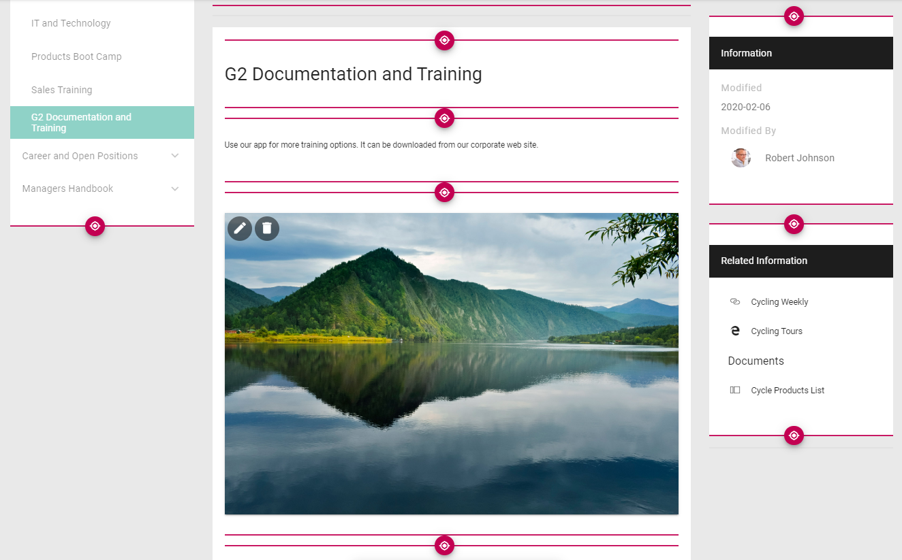
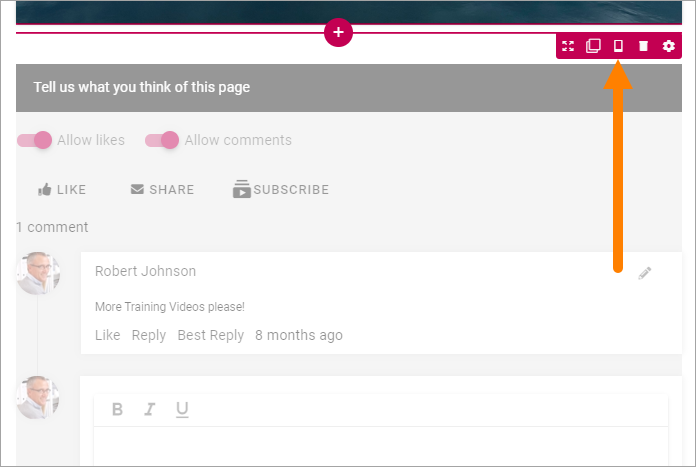
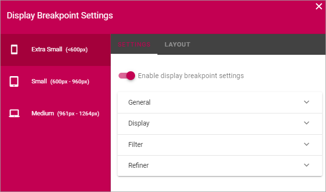
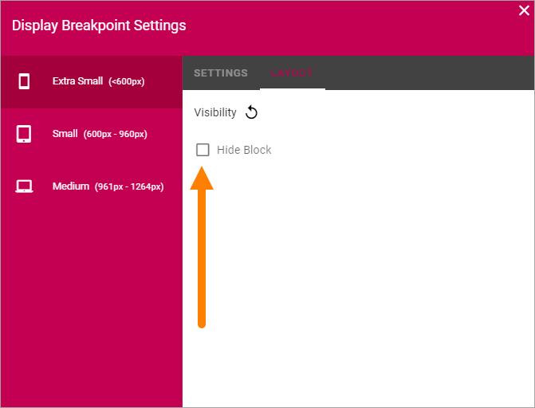
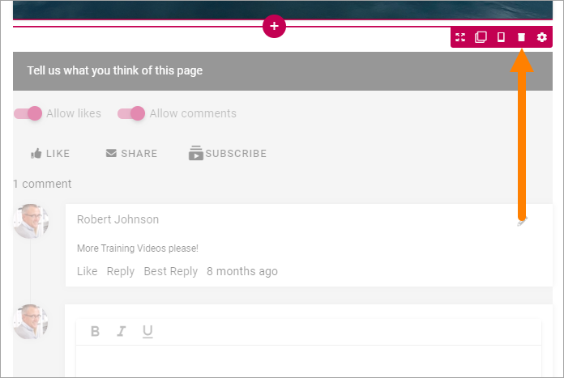

Working with blocks
=====================

This page contains general information about how to work with blocks in Design mode (but see information about Write mode at the bottom).

**Note!** The Blocks that belong to the Page Type is locked and can not be moved or deleted, and the settings can't be changed for these Blocks.

Adding blocks
**************
To add a block to a page, do the following:

1. Edit the page in Design Mode.
2. Click on the block that will be before or after the new block so you can se the pluses, and click on the appropriate one (the top one to place the new block above or the bottom one to place the block below).

.. image:: block-click-plus-new.png

3. Find the block you want to add and select it.

.. image:: block-select.png

Editing a block's settings
***************************
To edit a block's settings, do the following:

1. Edit the page in Design Mode.
2. Click the block.
3. Click the cog wheel for the block, for example:

.. image:: edit-block-settings-new.png

Information about how to change specific settings for a block is found in the block's detailed description.

Moving a block
***************
Do the following to move a block tp another placement on the page.

1. Click the block.
2. Click the Move icon.

.. image:: move-icon-new.png

Icons now show where you can move the block, for example:

3. Click the icon where you want the block and it's moved there.

Copying a block
****************
If you need a block with roughly the same settings somewhere else on the page, you can copy a block and place the copy where you want it, and then edit the settings. Do the following:

1. Click the block.
2. Click the Copy icon.

.. image:: copy-icon.png

Icons now show where you can move the block, the same way as when you move a block, for example:

.. image:: block-can-be-copied.png

3. Click the icon where you want the copied block and it's placed there.
4. Edit the settings that you want to change.

Show the block or not on different devices
********************************************
When you're working on a block you can select to show it on different devices or not.

Click this icon:

Then you can decide on which devices to show this block.

1. Click the device you want to change settings for.
2. Click "Enable display breakpoint settings.

.. image:: device-click-enable.png

Settings
---------
A number of settings are now shown, that you can alter for the selected device specifically. Available settings differ depending on the block. Here's an example:

You edit the settings the same way as you do in the block's settings, see the description of the block.

Layout
--------
Use the Layout tab if you want to hide the block for the device. Here's how you do that:

1. Click the Layout tab.
2. Click the pen to edit the Visibilty setting.

.. image:: device-visibility.png

3. Select Hide block.

Removing a block
*****************
To remove a block. do the following:

1. Edit the page in Design Mode.
2. Click the block.
3. Click the dust bin to remove the block:

**Note!** A block that belongs to the Page Type is locked and can not be removed. It is shown this way:

.. image:: locked-block-new2.png

Editing contents of a block
****************************
To work with blocks as is described above a user needs the permissions to use Design Mode (Editor). Page Authors are not allowed to use Design mode, but can use Write mode to edit the contents of a block.

.. image:: write-mode-new.png

Examples of blocks where the contents can be edited using Write mode:

+ Accordion
+ Banner
+ HTML/Script
+ Media
+ Related Links
+ Text

