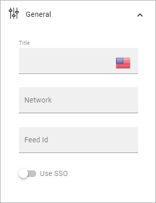
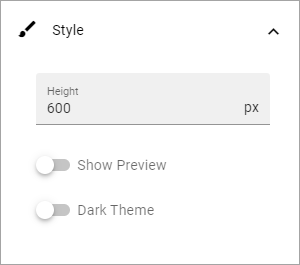

Yammer Feed
===============

This block is available in Omnia 6.5 and later. A Yammer Feed can be displayed in this block.

The following settings are available:

.. image:: yammer-feed-settings-all.png

General
************
Under General you can set the following:

+ **Title**: Add a title for the block, in any or all tenant languages (click the flag to change language).
+ **Network**: (A description will be added soon.)
+ **Feed id**: (A description will be added soon.)
+ **Use SSO**: (A description will be added soon.)

Style
**********
Some style settings will also be available:

+ **Height**: (A description will be added soon.)
+ **Show Preview**: (A description will be added soon.)
+ **Dark Theme**: (A description will be added soon.)

