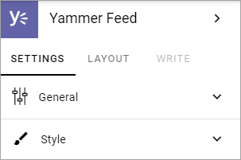
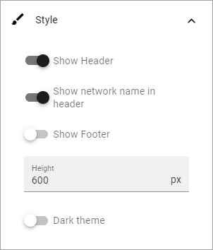

Viva Engage
===============

A Viva Engage feed (former Yammer feed) can be displayed in this block. 

**Note!** In an Omnia on-prem setup, a separate online Viva Engage subscription and internet access is required.

The following settings are available:

General
************
Under General you can set the following:

.. image:: yammer-feed-settings-general-new.png

+ **Title**: Add a title for the block, in any or all tenant languages (click the flag to change language).
+ **Home**: Select type of feed here; Home, Community, User or Topic.
+ **Set a custom publisher prompt**: For a Home feed you can set the publisher prompt.
+ **Search for the source**: Add the unique id for the community, user or topic here.
+ **Set the default community for posting**: Available for Home feed.
+ **Set a customer publisher prompt**: Available for Community feed.

Style
**********
Some style settings is also available:

+ **Show header**: Use this option to show the block header or not. Default: selected.
+ **Show network name in header**: Default: selected.
+ **Show Footer**: Default: not selected.
+ **Height**: You can set the height in pixels for the block. Default: 600 pixels.
+ **Dark theme**: To select a dark theme for the block, use this option.

