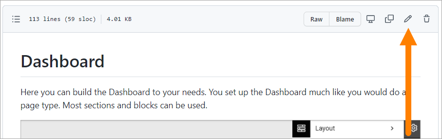
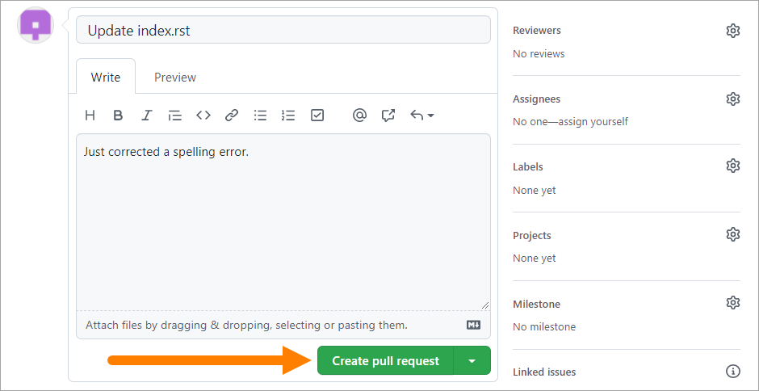

Contribute to this documentation
===================================

This documentation is a constant work in progress, and anyone can propose changes and additions here.

First thing first
********************
To be able to contribute to the documentation you must be signed in to a GitHub account, so the first thing you have to do is sign-up:

When you want to propose a change, you must make sure you're signed-in to your account.

Text edits
***********
For text edits, do the following:

1. Go to the page you want to edit.
2. Click "Edit on GitHub".

.. image:: edit-on-github.png

3. Click the pen to edit the file.

4. Edit the text as needed.
5. Scroll down to the bottom of the page.
6. Type a comment about the changes you made.
7. Select "Create a **new branch** for this commit and start a pull request".
8. Type a title for the changes (dashboard-edits in the example below).
9. Click "Propose changes".

.. image:: edit-on-github-propose.png

10. If you haven't already, add a comment.
11. If the Reviewers field is not pre populated, you must add a reviewer. You should primarily add the Documentation Project Manager there (at the moment Benny Eronson).

.. image:: edit-on-github-reviewer.png

12. Click "Create pull request".

Extensive edits
*****************
If you would like to contribute with more extensive changes or additions, as for example new images or a whole new page, contact the Documentation Project Manager for instructions.

