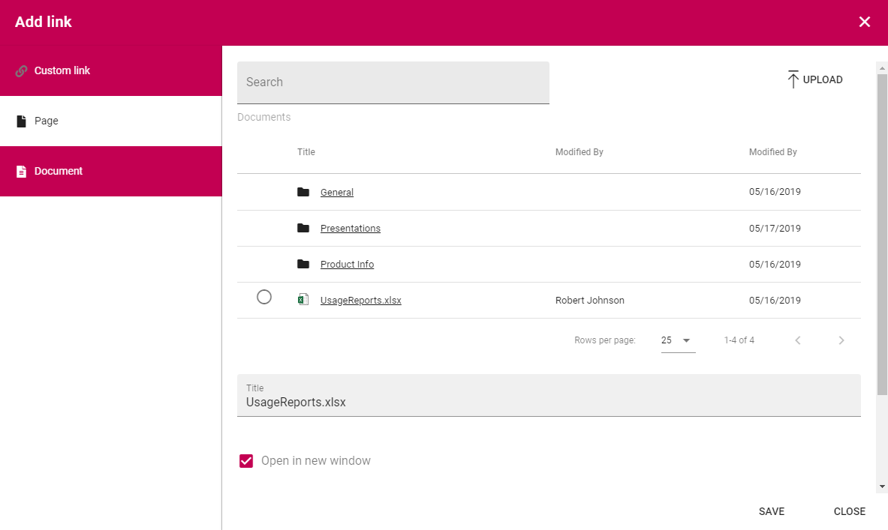
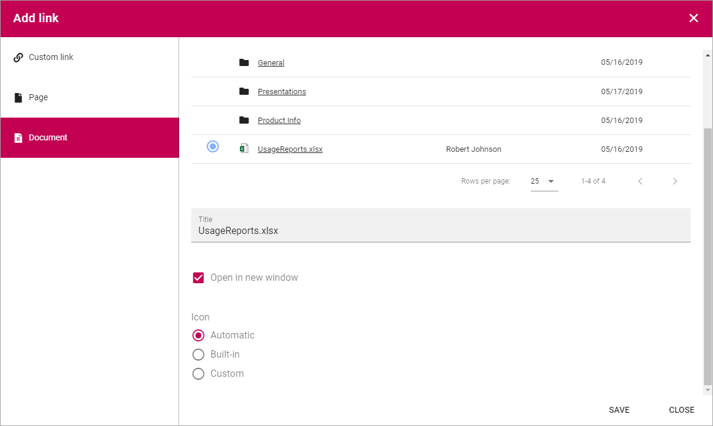

Add link
===========================================

Add link is used when a link is about to be added in a block and a few other instances. 

.. image:: add-link.png

You can use this asset to add a link to a page or document in the tenant, or create a Custom link to any web page.

Custom link
************
The following settings are available:

+ **Url**: Paste or type the Url (link) in this field.
+ **Title**: Type a text to be shown for the clickable link.
+ **Open in new window**: If the link should be opened in a new window, select this option. If not selected the link opens in th same window.
+ **Icon**: An Icon will be shown for each link. If you select "Automatic" the system will select the icon. Choosing "Built-in" you can select an icon from either "Font Awesome" or "Fabric", see below. If you select "Custom" you can use any image as an icon.

Here are some examples of Font Awesome icons:

.. image:: font-awesome.png

Here are some examples of Fabric icons:

.. image:: fabric.png

Save after each link added.

Page
******
First, select Page Collection. If the Page Collection isn't present in the list, select "Others..." so you can add the Url to any Page Collection.

.. image:: add-link-page.png

As the next step, navigate to the page and select it. Here's an example:

.. image:: add-link-page-example.png

Then use the options as above (Title, Open in new window and Icon).

Save after each Page link added.

Document
*********
To add a link to a Document, use the following options:

+ **Search**: Use this field to search for Document.
+ **Upload**: Click here to upload a Document to link to.
+ **Documents**: If the Document in any folder in the Document library here, use the folders to navigate to the Document and select it.
+ **Title**: The Document name is automatically added as the Title. Edit it if needed.

Here's an example with a Document selected:

Then use the rest of the options as above (Open in new window and Icon).

Save after each Document link added.

