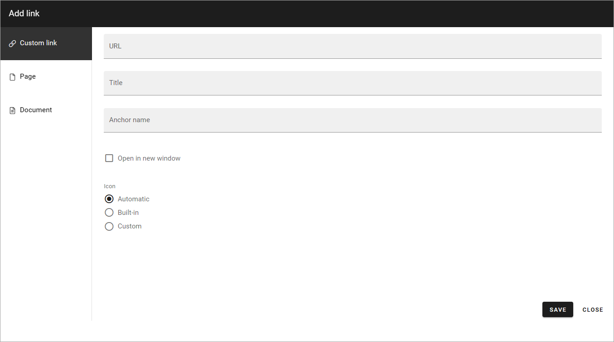
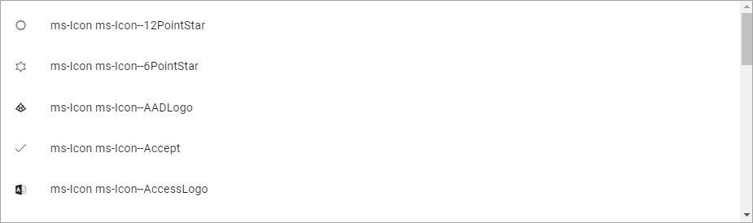
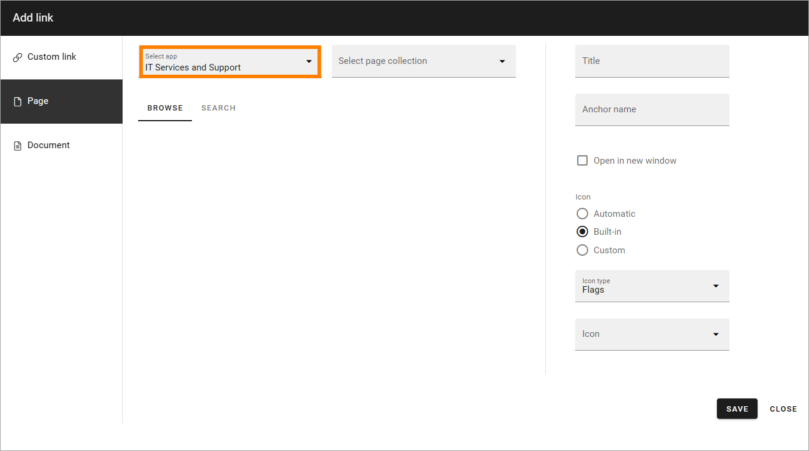
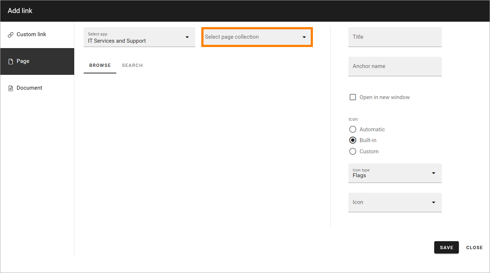
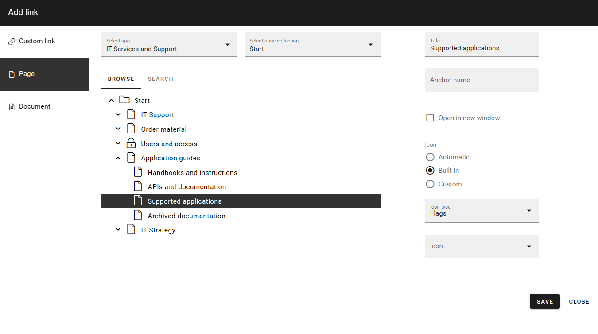

Add link
===========================================

Add link is used when a link is added in a block and a few other instances. 

You can use this asset to add a link to a page or document in the tenant, or create a custom link to any web page. A mailto link can be created using a custom link. Anchors are supported and can be used here, in a Custom link. 

Custom link
************
The following settings are available:

+ **URL**: Paste or type the URL (link) in this field. 
+ **Title**: Type a text to be shown for the clickable link.
+ **Anchor name**: To create a custom link to an anchor, type the anchor name in this field.
+ **Open in new window**: If the link should be opened in a new window, select this option. If not selected the link opens in the same window.
+ **Icon**: An Icon will be shown for each link. If you select "Automatic" the system will select the icon. Choosing "Built-in" you can select an icon from either "Font Awesome", "Microsoft" or "Flags", see below. If you select "Custom" you can use any image as an icon.

For information on how to use anchors, see: :doc:`Using anchors </general-assets/using-anchors/index>`

**Note!** When linking to an anchor you must always start by selecting the page the anchor is on.

Here are some examples of Font Awesome icons:

.. image:: font-awesome-new.png

Here are some examples of Microsoft icons:

If you select "Flags" you can add a colored flag as an icon, for example:

.. image:: flags-new.png

Save after each link added.

Page
******
To add a link to a page, do the following:

1. Select Publishing app, if needed.

2. Select page collection. 

If the page collection isn't present in the list, select "Others..." so you can add the URL to any page collection.

.. image:: select-other-v75.png

3. As the next step, navigate to the page and select it. Here's an example:

4. Then use the options as above (Title, Open in new window and Icon).

5. Save after each page link added.

Note that you can also link to an anchor on a page, using a custom link. See above. Anchors can be created by authors in any parts of text on a page, can be set for block headings and are automatically created for sections, steps and accordion sections.

Document
*********
When you want to link to a document, the options are exactly the same as those in "Document picker". For more information see: :doc:`Document picker </general-assets/document-picker/index>`

