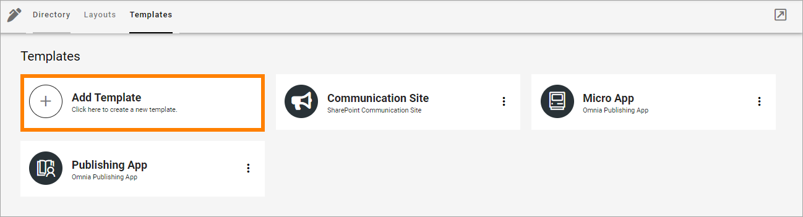
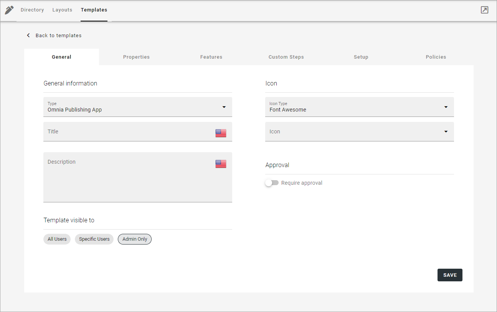
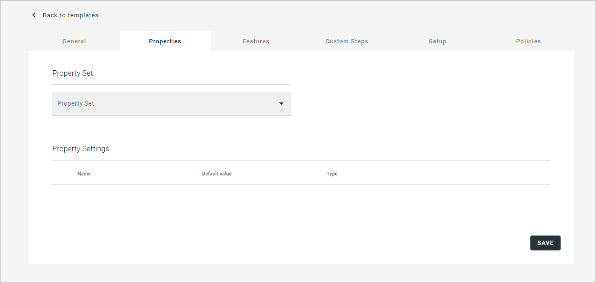
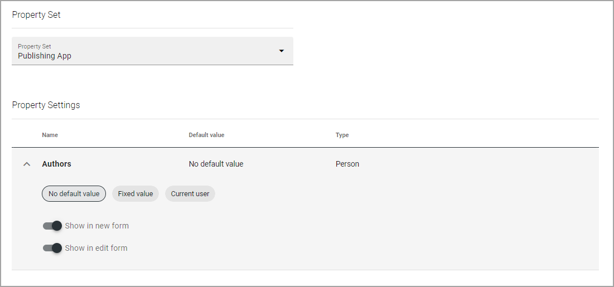
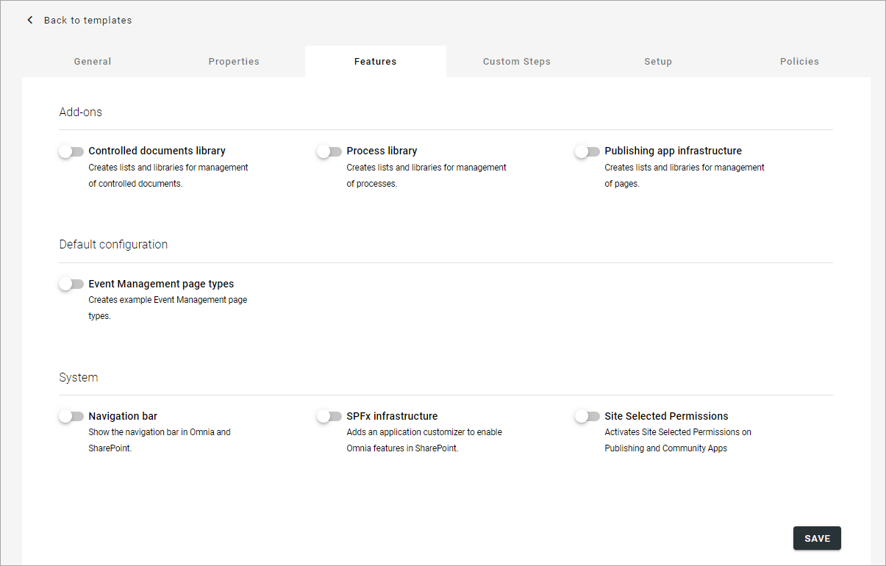
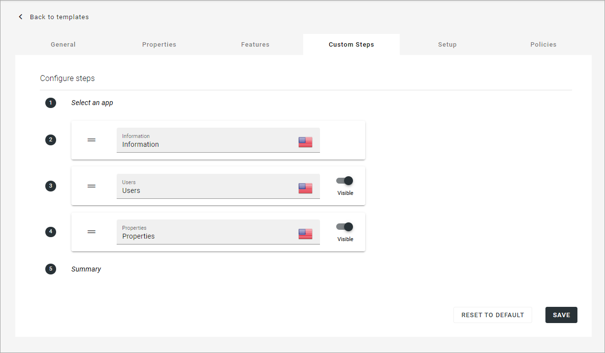
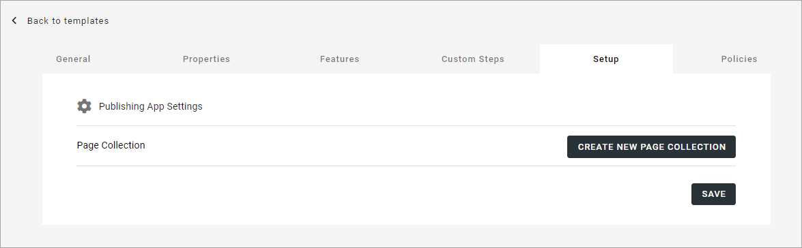
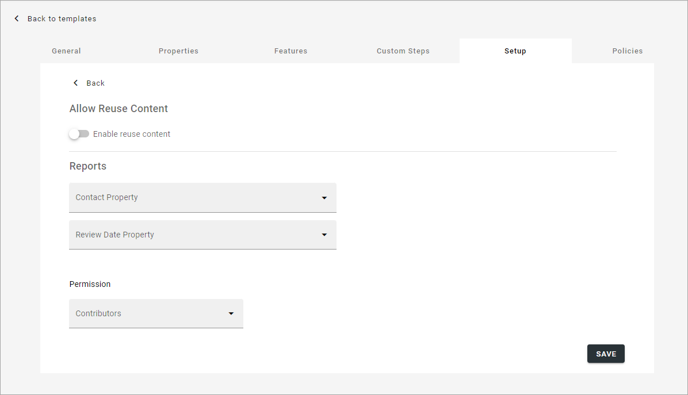
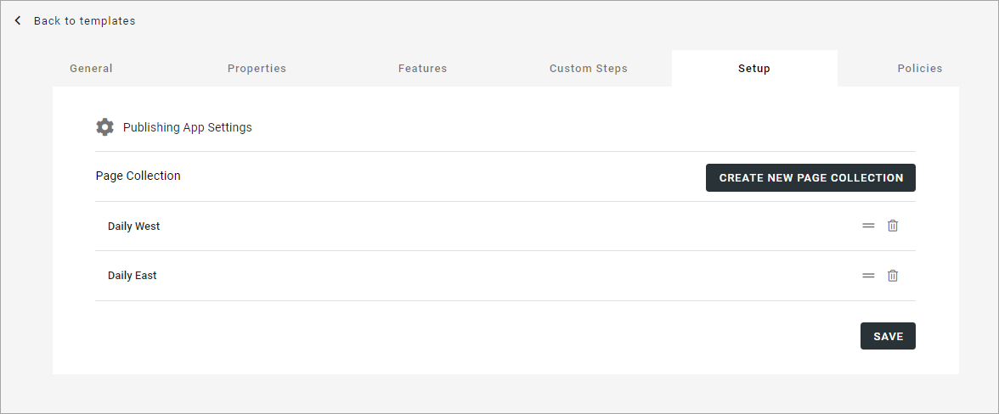
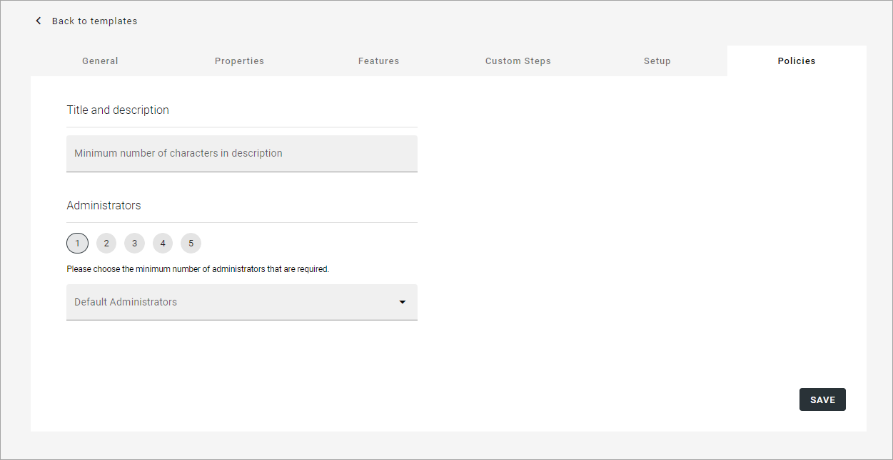

Creating app templates in Omnia v7
=============================================

In Omnia, templates for publishing apps, communities and teamwork are created in a simlar way. This page describes the general options for these three types of templates. See the respective page in Omnia admin for more information (links at the bottom of this page).

Images in this description from templates for publishing Apps.

Creating a new template
****************************************
To create a new template, do the following:

1. Click "Add template".

Use the following settings:

General
----------
The following settings are available here (see image above):

+ **Type**: You may be able to select a type if more than one is available.
+ **Title**: Add a title for the template. You can add titles in a number of the languages available in the tenant. Default language is mandatory. (Click the flag to change language).
+ **Description**: Add a description if needed. You can add a description in a number of the languages available in the tenant.(Click the flag to change language).
+ **Icon type**: An icon is always shown for a template. If you would like another icon for this template, select the set of icons here: Font Awesome, Microsoft, Flags or Custom. When selecting "Custom" you can choose any image as the icon.
+ **Template visible to**: Here you choose who can see and use the template. If you select "Specific users", an "Add targeting filter" option is shown. You use it the same way os the similar options in Omnia, see: :doc:`Use targetin </general-assets/targeting-in-omnia/index>`
+ **Icon**: When you have select icon type, use this list to select the icon. If you select "Custom", a URL field is shown, where you enter the URL for the image.
+ **Available To**: Here you select who the template should be available for. What "All users" and "Admins only" means is obvious. When you select "Specific users" you click "Add targeting filter", choose a property (for example Administration roles or Language) and set the necessary settings to create the targeting filter for the group of users you have in mind.
+ **Approval**: Here you select if approval is required when users create sites from this template. When you select "Require approval" you must also select one or more approvers.

Properties
------------
You can add a property set to the template. 

+ **Property Set**: Select property set here. The properties in the set can or will have to be filled in when an app is created from this template, depending on settings for the property. The property sets are set up using the tenant settings. See this page for more information: :doc:`Property sets </admin-settings/tenant-settings/properties/property-sets/index>`

When you have selected a property set someting like the following is shown:

+ **Default values**: Chose to add default values or nor. You can set default values for suitable properties in a set, valid for this template. Default values can be edited when an app is created from this template. 
+ **Show in new form**: Select for to properties to be available when an app is created from this template.
+ **Show in edit form**: Select for the properties to be available when the settings for the app is edited.

Features
----------
Activate the features that should be available for the publishing app. Available features depends on how the tenant is set up. Here's an example:

The features can be updated in Omnia admin using app features for the app. There you can also find more information about each feature.

Custom steps
---------------
If any custom steps has been developed for the creation of publishing apps, you can select them using this option. Here's an example:

Note the option to reset all custim steps to default.

Setup
-------
Using the options here you set ublishing app settings and can create one or more page collections to be set up automatically when this template is used.

To edit settings, click "Publishing app settings" and use the following settings (can be edited later by a publishing app administrator):

+ **Allow reuse content**: If publishing apps created from this template should allow reuse of content, select "Enable reuse content". 
+ **Contact property**: Select the default property for page contact.
+ **Review date property**: Select the default property for review date.
+ **Permisson**: Users, or groups, that should be able to take part in the sites activites should be added in this field. A suggestion can be added here, but it can be edited when a site is created from this template.

Information about how to create a page collection, and more information about page collections can be found here: :doc:`Page collections </pages/page-collections/index>`

When you have added one or more page collections, you can use the the icons to sort the order in which they are shown (left-most icon) or delete the page collection. 

You edit the settings for a page collection as is described here: :doc:`Page collection settings </page-collections/page-collection-settings/index>`

Policies
***********
Use this for further policies settings, that will be applied to publishing apps created from this template. 

The following can be set here:

+ **Minimum number of characters in description**: Here you can set a number of characters for the description of the publishing app, to force users to add a description of a certain length. 
+ **Minimim number of administrators**: Click a number to set the minimum number of administrators. There must always be at least one administrator for a publishing app, but you can decide that more administrators should be required, up to 5.
+ **Default administrators**: Use this to add one or more default administrators for publisning apps created from this template. These administrators will always be added, and can not be removed in the create publishing app wizard. Must be persons, can not be groups.

Additional information
***********************
In some cases, additional settings are available.

When creating a template for a **Yammer community**, the setup step is different. See the bottom of this page: :doc:`Templates for communities in Omnia v7 </admin-settings/business-group-settings/communities/communities-v7/templates/index>`

When creating a template for a **SharePoint communication site**, the setup step is slightly different. See the bottom of this page: :doc:`Templates for publishing apps in Omnia v7 </admin-settings/business-group-settings/publishing-apps/publishing-v7/templates-v7/index>`

Regarding templates for **Teamwork**, there are differences for Microsoft 365 Group, SharePoint team site, Microsoft Team and Private Yammer community. See this page for more information: :doc:`Teamwork templates in Omnia v7 </admin-settings/business-group-settings/team-collaboration/teamwork-v7/templates/index>`

