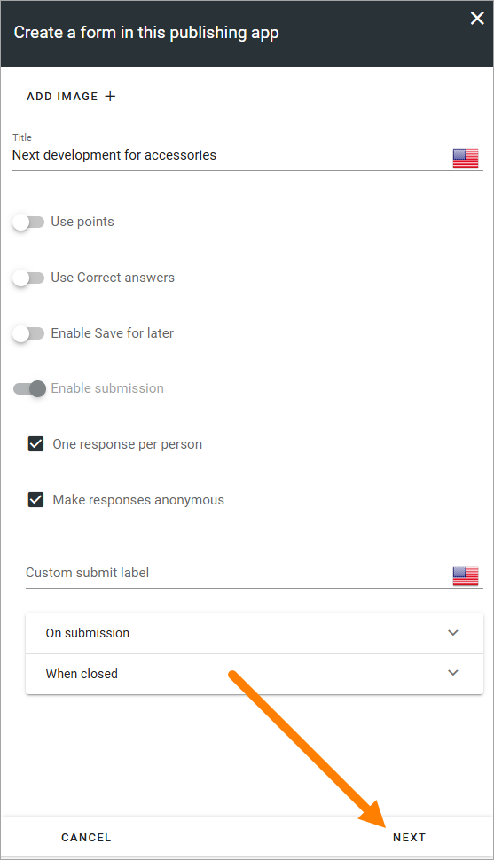
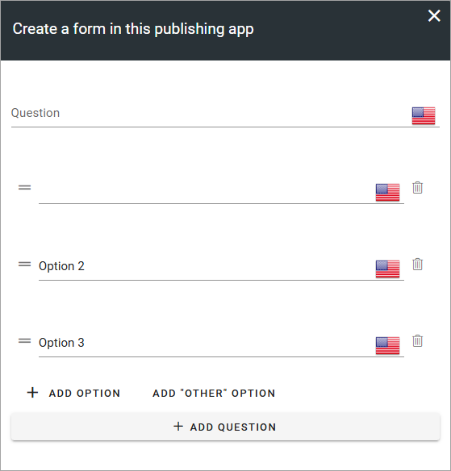
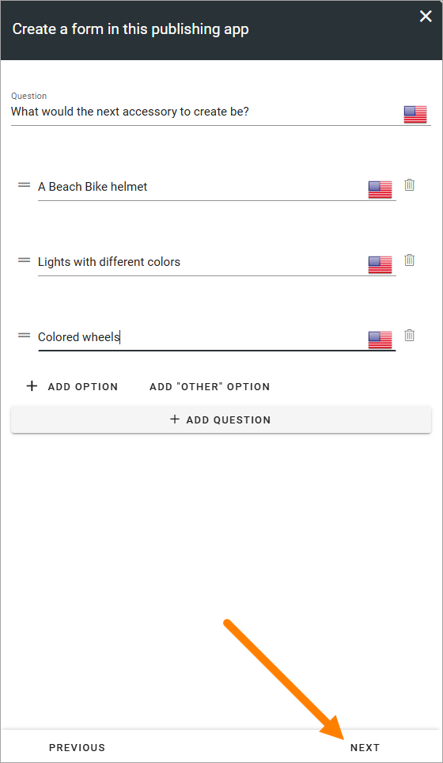
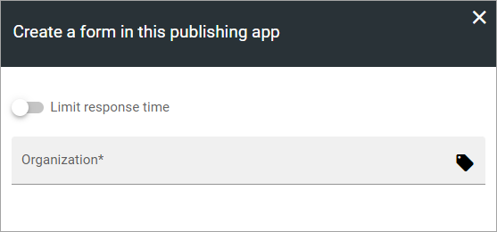
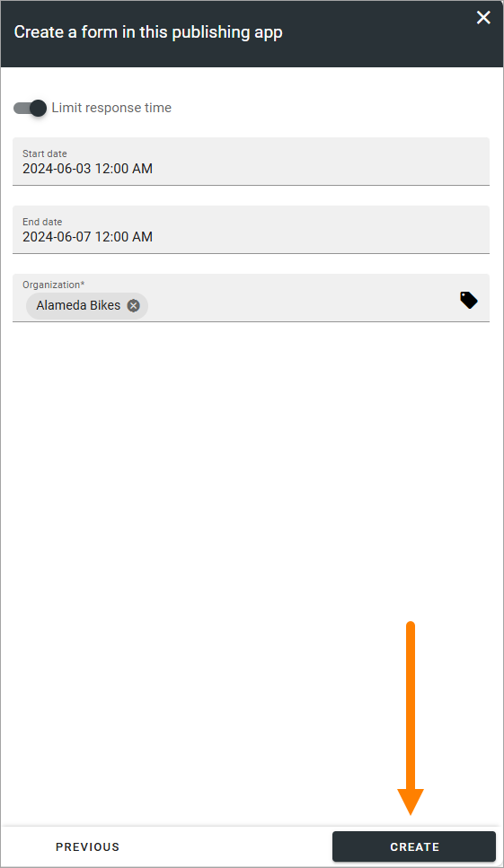

Creating a form using an action button
========================================================

**This documentation is ongoing. More details will be added soon.**

In Omnia 7.6 and later, an action button can be placed on any publishing page, to make it possible to create a form to be used in a publishing app.

It's meant to be faster and easier, so the options are limited compaired to creating forms using the options in Omnia Admin.

**Note!** A page editor must still see to that the form you create is actually available for users, using a Forms block or a Forms rollup block.

You must be publishing app administrator for the app you create the form for, to be able to use the button. This is an important difference compaired to the options in Omnia admin, where you have to be business profile administrator to create and edit forms.

The button can be formatted in many ways. In this example a crude form is used. The options can also be set up by in a number of ways, for examaple in what app the form will be created, so what is shown here it's just an example.

Here's how to create a form using an action button:

1. Click the button.

2. If it's possible to change the settings for the form (the page editor setting up the button decides if it is, or not), edit the settings as you need them, and then click "Next":

For descriptions of the options, see the heading "Settings for a template" on this page: :doc:`Templates for forms </admin-settings/business-group-settings/forms/forms-settings/forms-templates/index>`

**Note!** You must add a title to be able to go to the next step.

3. Add the question and the possible answers here:

This is the first step if it's not possible to edit the settings (if not, the settings are simply not shown). It's always possible to add more options (possible answers) and it may, depending on settings, be possible to add more questions.

4. Click "Next" when you're finished with all questions and options.

5. Select properties and use other options if available.

What will be available here will differ a lot depending on set up, but generally, if it's possible to select proerties, that should always be done. In this example you can choose to limit response time, meaning you can set a start and an end date. You can also select Organization, to decide who the form will be available for.

6. Click "Create" when you're done.

