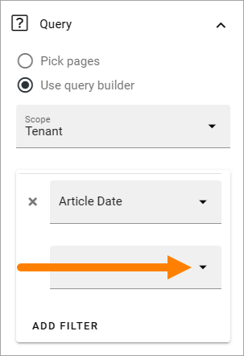
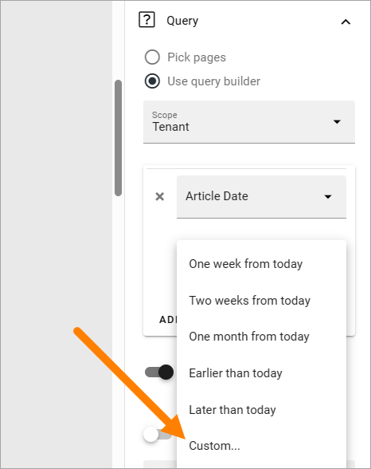
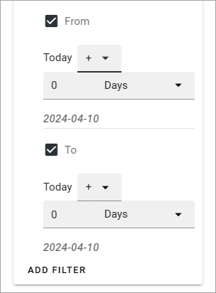
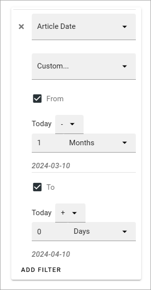

Custom date filtering
========================

For some rollups, custom date filtering is available, if the scope is filtered on some kind of time property.

1. Open the list with filtering options below the property.

2. Select "Custom".

(Note: "today" has been changed to "now" in later Omnia versions, 

3. Use the detailed settings for a custom time period:

Use the small list (where is says "+" now) to select if it's before or after today, by choosing minus or plus.

Use the broader list to select Days, Months or Years.

Here's a simple example where pages published from a month ago to today, based on the property Artcle date, will be rolled up:

