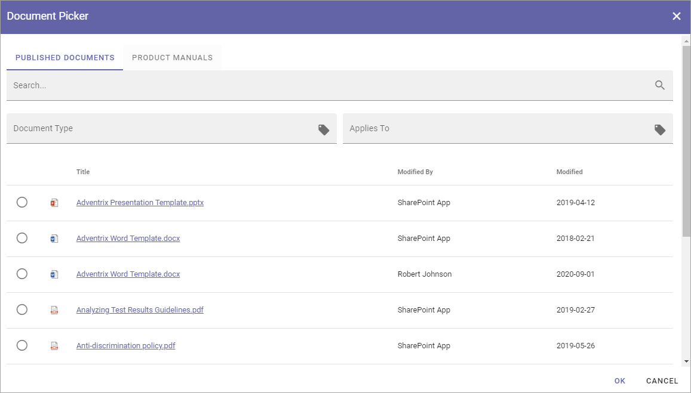

Document picker
=================

The document picker is used in various places in Omnia where documents is selected. What will actually be available in the picker depends on settings in Omnia admin. Here's an example:

Use the document picker this way:

1. Select tab if more than one is shown.
2. Select a document.
3. Click "OK".

If the list is long, use the navigation at the bottom of the page to go between pages:

.. image:: document-picker-navigation-new.png

Depending on settings, a search can be available, and it can also be possible to filter the list on a property, in this example on document type. A second step can be available for the property, as "Applies to" in this example. 

.. image:: document-picker-search-new.png

Settings for the document picker
*********************************
Settings for the document picker is found in the business Profile, see: :doc:`Document picker settings </admin-settings/business-group-settings/settings/document-picker/index>`

