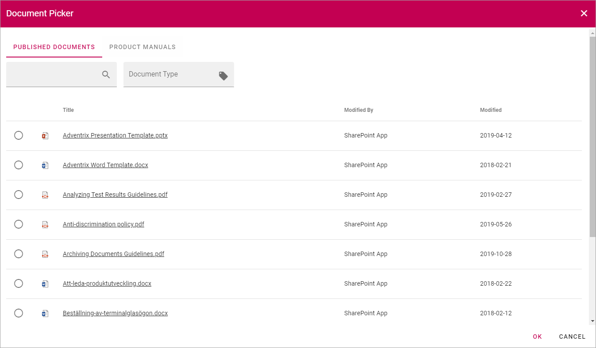
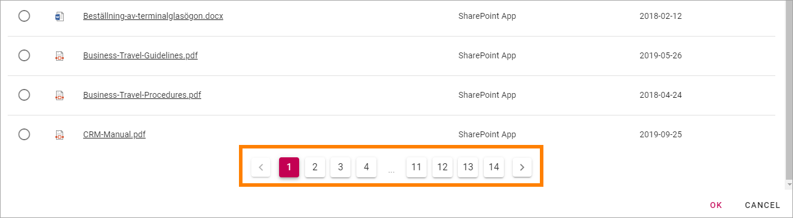
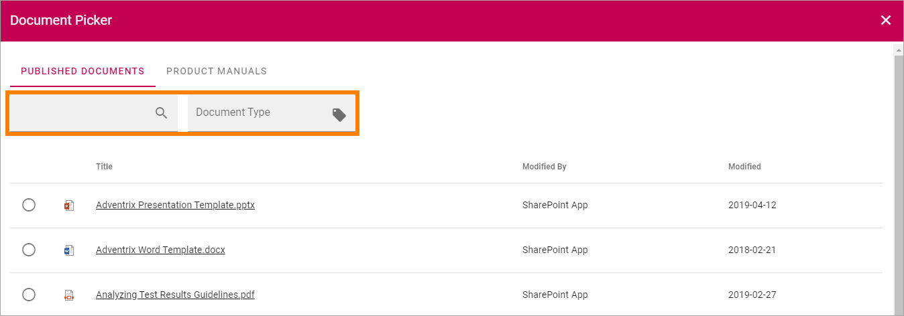

Document Picker
=================
**(This documentation is just started, more will be added soon.)**

The Document Picker is used in various places in Omnia where documents is selected. What will actually be available in the picker depends on settings in Omnia Admin. Here's an example:

Use it this way:

1. Select tab if more than one is shown.
2. Select a document.
3. Click "OK".

If the list in the tab is long, used the navigation at the bottom of the page to go between pages:

Depending on settings in Omnia Admin, a search can be available, and it can also be possible to filter the lists on a property, in this example on Document Type:

