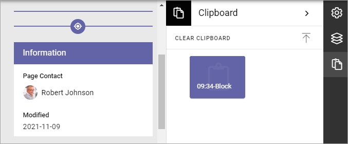
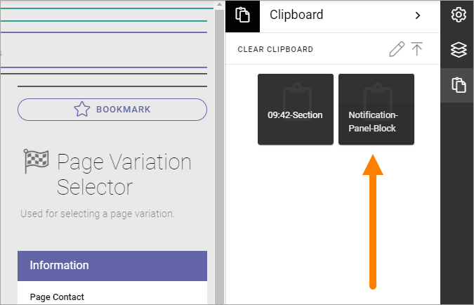
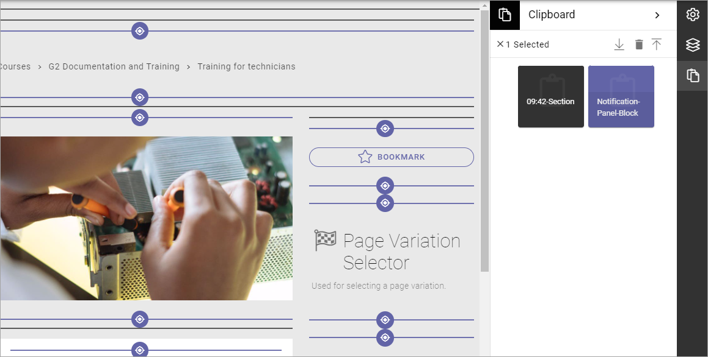

Clipboard for sections and blocks
=======================================

Using this feature, available in Omnia 6.7 and later, you can copy sections and blocks between pages or page types. You must be able to use Design Mode to use the clipboard.

The clipboard is available here:

.. image:: clipboard.png

Layout templates, the third icon from the top in the image above, is only available when editing Page Types. The other three options are available for pages as well.

Add a section or block to the clipboard
*****************************************
Every time you copy a section or a block, a copy is placed in the clipboard.

1. Click the copy icon for the section or block.

.. image:: clipboard-copy-block.png

**Note!** You can copy a locked section or block as well.

The clipboard opens and a copy is placed there, for example:

2. You can now delete the copy if you don't want to keep it, or edit the label of the copy, see below.

Add a section or a block from the clipboard
**********************************************
Do the following to copy a section or a block from the clipboard:

1. Edit the Page or Page Type in Design Mode.
2. Open the clipboard.

.. image:: clipboard-open.png

3. Click the section or block you want to place on the Page or Page Type.

4. Click to place on the Page/Page Type (block as example).

Handle the clipboard
**********************
Here's what you can do with the clipboard.

Edit labels
-------------
To edit the labels for the copies in the cliboard, do the following.

1. See to that nothing is selected in the clipboard.
2. Click the pen.

.. image:: clipboard-click-pen.png

3. Click the section or block you want to edit.
4. Type the new label.
5. Change the size if needed (so a longer label will be shown).

.. image:: clipboard-click-pen-size.png

Delete sections or blocks from the clipboard
----------------------------------------------
Here's how:

1. Click the section(s) or block(s) you want to delete.
2. Click the dust bin.

.. image:: clipboard-delete-one.png

There's a quicker way if you want delete everything in the clipboard:

1. See to that nothing is selected.
2. Select CLEAR CLIPBOARD.

.. image:: clipboard-clear.png

Export or import clipboard
-----------------------------
You can also export or import the clipboard. Information on how this is done will be added soon.

