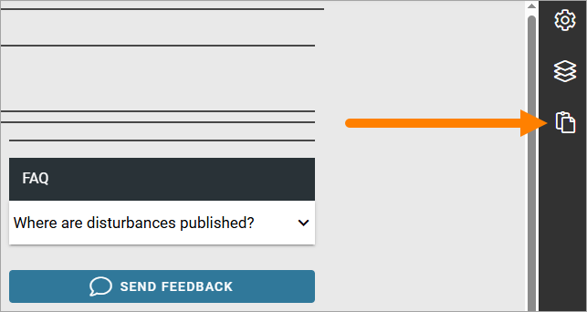
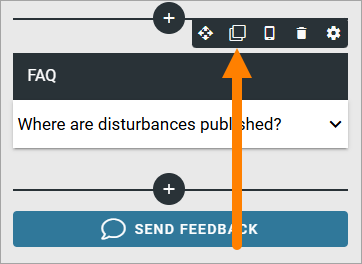
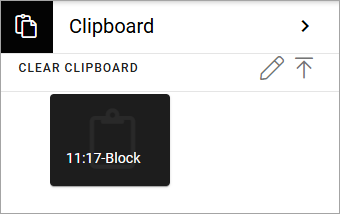
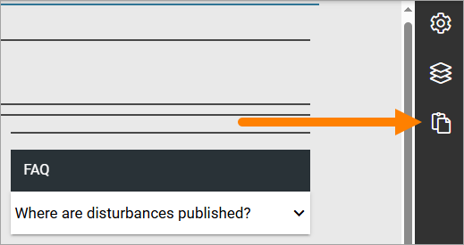
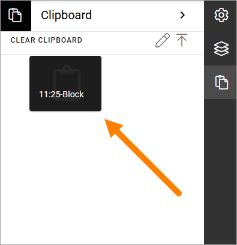
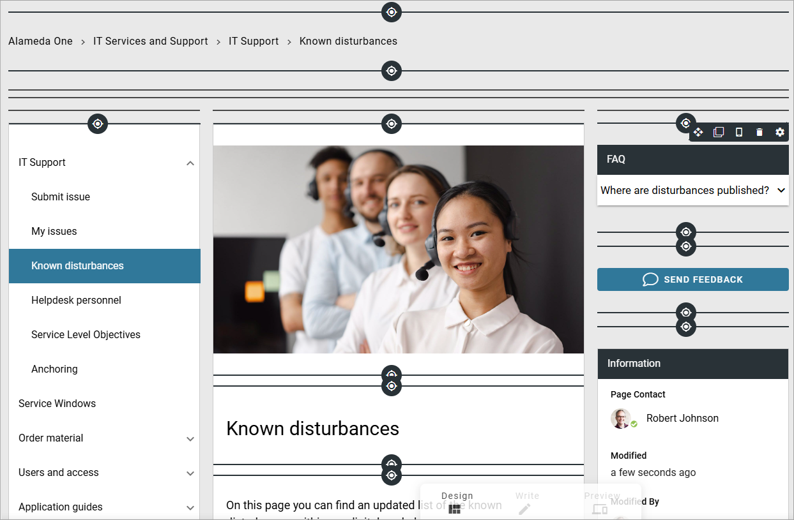
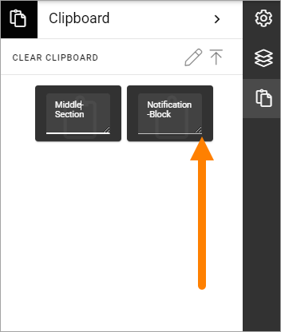
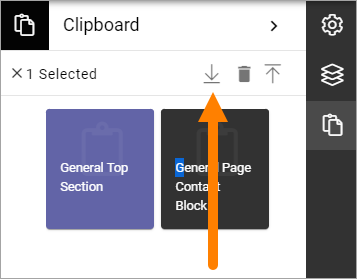

Clipboard for sections and blocks
=======================================

Using this feature, you can copy sections and blocks between pages or page types. You must be able to use Design Mode to use the clipboard.

The omnia clipboard exists within a tenant, a domain and a computer. So if you're an editor using more than one computer, you will have a separate clipboards for each computer, even if you're working with the same tenant.

The clipboard is available here:

Layout templates, the third icon from the top in the image above, is only available when editing page types. The other three options are available for pages as well.

Add a section or block to the clipboard
*****************************************
Every time you copy a section or a block, a copy is placed in the clipboard.

1. Click the copy icon for the section or block.

**Note!** You can copy a locked section or block as well.

The clipboard opens and a copy is placed there, for example:

2. You can now delete the copy if you don't want to keep it, or edit the label of the copy, see below.

Add a section or a block from the clipboard
**********************************************
Do the following to copy a section or a block from the clipboard:

1. Edit the page or page type in design mode.
2. Open the clipboard.

3. Click the section or block you want to place on the page or page type.

4. Click to place on the page/page type. Icons are displayed where ut's possible (block as example).

Handle the clipboard
**********************
Here's what you can do with the clipboard.

Edit labels
-------------
To edit the labels for the copies in the clipboard, do the following.

1. See to that nothing is selected in the clipboard.
2. Click the pen.

.. image:: clipboard-click-pen.png

3. Click the section or block you want to edit.
4. Type the new label.
5. Change the size if needed (so a longer label will be shown).

Delete sections or blocks from the clipboard
----------------------------------------------
Here's how:

1. Click the section(s) or block(s) you want to delete.
2. Click the dust bin.

.. image:: clipboard-delete-one.png

There's a quicker way if you want delete everything in the clipboard:

1. See to that nothing is selected.
2. Select CLEAR CLIPBOARD.

.. image:: clipboard-clear.png

Export or import clipboard
-----------------------------
You can also export or import the Omnia clipboard to Windows clipboard, and thus be able to copy sections ands blocks between tenants. 

Do the following to export objects from the Omnia clipboard:

1. Select the blocks or sections you want to export.
2. Click the "Export clipboard" icon. 
3. To save clipboard content to a file, open your favourite text editor and paste the clipboard content using Ctrl+V.

Note that you export just the objects you have selected, not the whole clipboard. In the example above, only the section will be exported, not the block.

Do the following to import objects from Windows clipboard.

1. Open the Omnia clipboard.
2. Click the "Import clipboard" icon.
3. Paste the clipboard content exported in previous steps.

.. image:: clipboard-import.png

