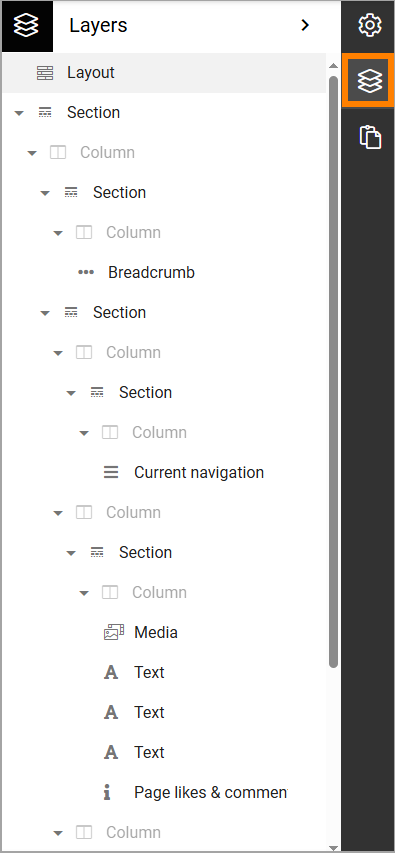

Layers
==========

In the Layout explorer (Layers) you can see an overview over all sections and blocks used on the page, for example:

You can click any section or block to activate it for editing. Note that focus is not moved automatically. You may have to scroll to find the section or block.
